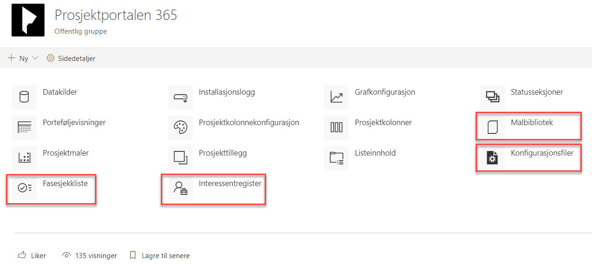

# Standardinnhold og endring av standardinnhold

Standarddokumenter, standardinteressenter, standardoppgaver og standard
fasesjekkpunkter vedlikeholdes på porteføljenivå, og kan enkelt endres
av en administrator eller bruker med riktig tilgang. Når
Prosjektportalen installeres, fylles flere av disse listene med
standardinnhold fra Prosjektveiviseren.

Innhold fra listene og biblioteket vil kunne kopieres inn i alle nye
prosjekter som blir opprettet i denne porteføljen (dette er valg som kan
gjøres ved opprettelse av et nytt prosjekt).

Innhold vedlikeholdes i *Konfigurasjon av Prosjektportalen* som du
finner under avsnittet for ‘*Utseende og funksjonalitet’* i
områdeinnstillinger. I bildet under er de fire standardlistene markert.
Trykk på den du ønsker å endre innhold i for å legge til, fjerne eller
endre elementer.

