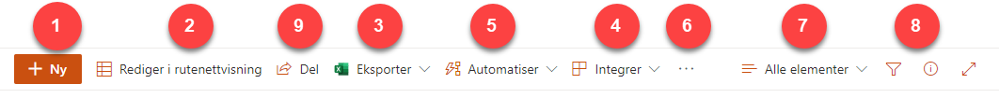
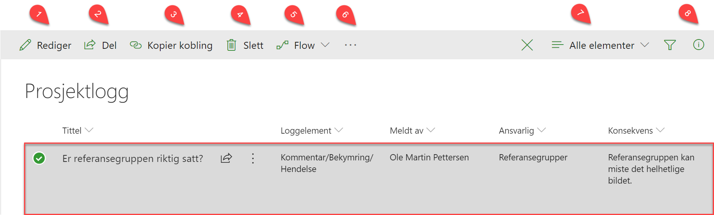

# Arbeide med lister og biblioteker i SharePoint
{: .no_toc}

## Innhold
{: .no_toc .text-delta }

1. TOC
{:toc}

De fleste av prosjektverktøyene består av SharePoint-lister som er tilpasset ulike formål. I listene er det en del fellesnevnere som er verdt å lære seg for å gjøre det enklere å arbeide med dem.

I Prosjektportalen omfatter disse *Prosjektlogg, Interessentregister, Kommunikasjonsplan, Usikkerhet, Dokumenter, Fasesjekkliste, Endringsanalyse, Gevinstanalyse og gevinstrealiseringsplan, Måleindikatorer, Gevinstoppfølging, Prosjektleveranser og Ressursallokering.*

Merk at hvert element har egne felter (kolonner), avhengig av
informasjonen som er relevant for den lista. Redigering; legge til, slette eller endre oppføring i listene er lik for alle. Det vil si at når du har lært deg å redigere en liste kan du benytte deg av samme metode for de andre listene.

Menyene tilpasser seg det du gjør, så ved å markere en oppføring i en liste får du andre menyvalg enn hvis den ikke er markert.

## Listemenyen, når du ikke har valgt et element

1.  ***Ny*** lar deg legge til et nytt element i lista.
2.  ***Hurtigredigering*** lar deg gjøre raske endringer i lista i tabellform.
3.  ***Eksporter til Excel*** eksporterer listen til en Excel-fil som lastes ned på PC-en din.
4.  *Integrer* lar deg opprette og behandle Power Apps, Power Automate og Power BI.
5.  Med *Automatiser* kan du enkelt opprette en ny Flyt relatert til listen du stå i. Man kan også lett komme seg til en oversikt over sine Flyter for å kunne jobbe videre med disse.
6.  *Ellipsemenyen*  gir deg flere valg, for eksempel
    ***Varsle meg*** om du ønsker varsler på endringer i lista.
7.  ***Alle elementer*** og ***Filterikonet*** lar deg se de ulike visningene som er tilgjengelige for lista. Du kan også lage egne visninger om ønskelig.
8.  ***Informasjonsikonet***  viser de siste endringene som har skjedd i lista.
9.  ***Del*** gir deg anledning til å dele listen, enten direkte eller ved å hente ut en lenke som du sender selv.

## Listemenyen, når et element er valgt

I bildet under har vi markert et element i prosjektloggen. Da endrer menyen seg til å gjelde endringer i oppføringen som du har valgt:

1.  *Rediger* lar deg redigere valgt element.
2.  ***Del*** lar deg dele valgt element med en eller flere brukere (med eller uten tilgang til selve prosjektet)
3.  Trykk på ***Kopier kobling*** for å lage en kobling til valgt
    element som gir tilgang til alle som får koblingen tilsendt. Etter koblingen er opprettet kan den enkelt fjernes (sammen med delingen) fra samme sted.
4.  Trykk på *Slett* for å slette det valgte elementet.
5.  Med *Flyt* kan du kjøre flyter som allerede er knyttet til listen, eller du kan opprette helt egne Flyter
6.  Ellipsemenyen ![) gir deg flere menyvalg, bl.a.
    versjonsloggen som gir deg tilgang til alle versjoner og historikk tilhørende valgt element. Du kan også sette opp varsel på enkeltelementer ved å trykke på ***Varsle meg*** etter at et element er valgt som i bildet over.
7.  ***Alle elementer*** og ***Filterikonet*** lar deg se de ulike visningene som er tilgjengelige for lista. Du kan også lage egne visninger om ønskelig.
8.  ***Informasjonsikonet***  viser de siste endringene som har skjedd i lista.

## Bruk ellipsemenyen med listeelementer

Når du har valgt et element i en liste kan du høyre-klikke på elementets tittel eller trykke på ellipsemenyen  for å velge hva du vil gjøre med elementet.

Hvilke handlinger som kan velges i ellipsemenyen bestemmes av hva slags element du har valgt. Derfor vil tilgjengelige valg være avhengig av hva slags liste, og hva slags element, du jobber med.

|                                   |                                                           | 
| --------------------------------- | --------------------------------------------------------- | 
| **Åpne**                          | Elementet åpnes i sidemenyen (lesemodus)                  | 
| **Rediger**                       | Elementet åpnes i sidemenyen (redigeringsmodus)           | 
| **Del**                           | Del det merkede elementer med andre personer              | 
| **Kopier kobling**                | Få en kobling for å dele adressen til elementet           | 
| **Kopier felt til utklippstavle** | Hvis du skal kopiere inn innholdet i feltet et annet sted | 
| **Slett**                         | Slett det valgte elementet                                | 
| **Flyt**                          | Aksjoner knyttet til Flyt på det aktuelle elementet       | 
| **Versjonslogg**                  | Viser versjonsloggen for elementet                        | 
| **Varsle meg**                    | Sett opp varsel på elementet                              | 
| **Mer**                           | Øvrige handlinger som er mulige for dette elementet       | 
| **Detaljer**                      | Åpner egenskapsfeltet for elementet i sidemenyen          | 

## Bruk ellipsemenyen med dokumenter

Når du har valgt et dokument i et bibliotek kan du høyreklikke på
dokumentets tittel, eller trykke på ellipsemenyen
 for å velge hva du vil gjøre med
dokumentet.

|                          |                                                                     | 
| ------------------------ | ------------------------------------------------------------------- | 
| **Åpne**                 | Dokumentet åpnes i sidemenyen (lesemodus)                           |
| **Forhåndsvis**          | Viser hvordan dokumentet ser ut                                     |                          
| **Del**                  | Del det merkede dokumentet med andre personer                       |                          
| **Kopier kobling**       | Få en kobling som andre kan bruke for å få tilgang til dokumentet   |                          
| **Lagre til senere**     | Du kan markere dokumentet for gjenfinning                           |                          
| **Last ned**             | Last ned en kopi av dokumentet til din lokale maskin                |                          
| **Slett**                | Slett det valgte dokumentet                                         |                          
| **Flyt**                 | Aksjoner knyttet til Flyt på det aktuelle elementet                 |                          
| **Gi nytt navn**         | Endre navnet på dokumentet                                          |                          
| **Fest til toppen**      | Dokumentet markeres for visning som flis over biblioteket           |                          
| **Flytt til**            | Du kan flytte dokumentet til en annen plassering                    |                          
| **Kopier til**           | En kopi av dokumentet kan opprettes på en annen plassering          |                          
| **Versjonslogg**         | Viser versjonsloggen for dokumentet                                 |                          
| **Varsle meg**           | Sett opp varsel på dette dokumentet                                 |                          
| **Mer**                  | Øvrige handlinger som er mulige for dette dokumentet                |                          
| **Last ned som** **PDF** | Dokumentet lastes ned til lokal maskin og blir lagret i .pdf format |                          
| **Lagre som** **PDF**    | En kopi av dokumentet i .pdf-format blir lagret i biblioteket       |                          
| **Detaljer**             | Åpner egenskapsfeltet for dokumentet i sidemenyen                   |    
