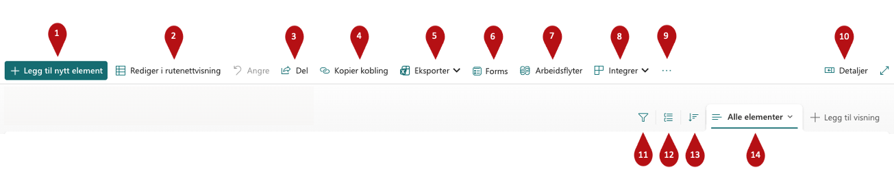
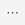
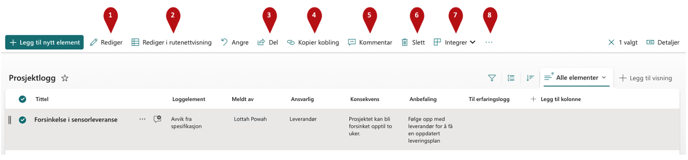
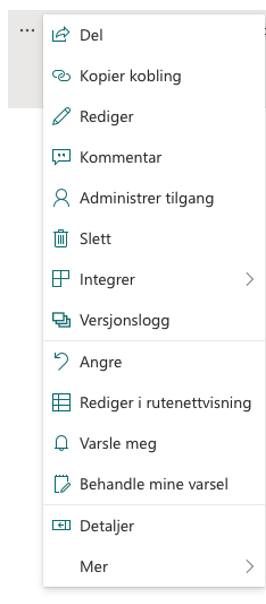
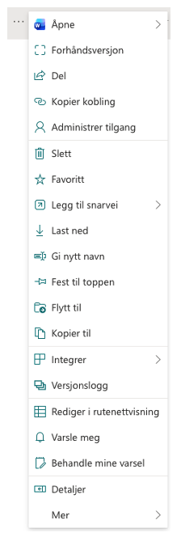

# Arbeide med lister og biblioteker i SharePoint
{: .no_toc}

## Innhold
{: .no_toc .text-delta }

1. TOC
{:toc}

De fleste av prosjektverktøyene består av SharePoint-lister som er tilpasset ulike formål. I listene er det en del fellesnevnere som er verdt å lære seg for å gjøre det enklere å arbeide med dem.

I Prosjektportalen omfatter disse *Prosjektlogg, Interessentregister, Kommunikasjonsplan, Usikkerhet, Dokumenter, Fasesjekkliste, Endringsanalyse, Gevinstanalyse og gevinstrealiseringsplan, Måleindikatorer, Gevinstoppfølging, Prosjektleveranser og Ressursallokering.*

Merk at hvert element har egne felter (kolonner), avhengig av
informasjonen som er relevant for den lista. Redigering; legge til, slette eller endre oppføring i listene er lik for alle. Det vil si at når du har lært deg å redigere en liste kan du benytte deg av samme metode for de andre listene.

Menyene tilpasser seg det du gjør, så ved å markere en oppføring i en liste får du andre menyvalg enn hvis den ikke er markert.

## Listemenyen, når du ikke har valgt et element

1.  ***Legg til nytt elemet*** lar deg legge til et nytt element i lista.
2.  ***Rediger i rutenettvisning*** lar deg gjøre raske endringer i lista i tabellform.
3.  **Del** gir deg anledning til å dele listen, enten direkte eller ved å hente ut en lenke som du sender selv.
4.  **Kopier kobling** kopierer lenke til listen.
5.  **Eksporter** gir deg mulighet for å eksportere listen til Excel-fil, CSV-fil eller CSV-fil med skjema som lastes ned til din PC. Du har også mulighet til å eksportere til Power BI.
6.  **Forms** gir deg mulighet til å lage en forms med alle kolonnene i listen.
7.  Med **Automatiser** kan du enkelt opprette en ny Flyt relatert til listen du står i. Man kan også lett komme seg til en oversikt over sine Flyter for å kunne jobbe videre med disse.
8.  **Integrer** lar deg opprette og behandle Power Apps, Power Automate og Power BI.
9.  **Ellipsemenyen**  gir deg flere valg, for eksempel **Varsle meg** om du ønsker varsler på endringer i lista.
10.  **Detaljer**-knappen tar deg til en oversikt som viser de siste endringene som har skjedd i lista.
11.  Med **Filterikonet** kan du filtrere i listen
12.  **Grupper etter** ikonet lar deg gruppere visning etter ønsket kolonne
13.  **Sorter** ikonet gir deg mulighet å sortere visningen etter ønsket verdi/kolonne
14.  **Alle elementer** lar deg se de ulike visningene som er tilgjengelige for lista. Du kan også lage egne visninger om ønskelig.

## Listemenyen, når et element er valgt

I bildet under har vi markert et element i prosjektloggen **(trykk på bildet for fullskjerm)**. Da endrer menyen seg til å gjelde endringer i oppføringen som du har valgt:

1.  **Rediger** lar deg redigere valgt element.
2.  ***Rediger i rutenettvisning*** lar deg gjøre raske endringer i lista i tabellform.
3.  **Del** lar deg dele valgt element med en eller flere brukere (med eller uten tilgang til selve prosjektet)
4.  Trykk på **Kopier kobling** for å lage en kobling til valgt element som gir tilgang til alle som får koblingen tilsendt. Etter koblingen er opprettet kan den enkelt fjernes (sammen med delingen) fra samme sted.
5. **Kommentar** lar deg kommentere eller notere i det enkelte elementet. Du kan se tidligere kommentarer andre har lagt inn på elementet. 
6.  Trykk på **Slett** for å slette det valgte elementet.
7.  Med **Automatiser** kan du kjøre regler som allerede er knyttet til listen, eller du kan opprette nye
8.  **Ellipsemenyen**  gir deg flere menyvalg, bl.a. versjonsloggen som gir deg tilgang til alle versjoner og historikk tilhørende valgt element. Du kan også sette opp varsel på enkeltelementer ved å trykke på **Varsle meg** etter at et element er valgt som i bildet over. Ved å velge ***Behandle mine varsler** kan du behandle varsler som du satt opp.

## Bruk ellipsemenyen med listeelementer

Når du har valgt et element i en liste kan du høyre-klikke på elementets tittel eller trykke på ellipsemenyen  for å velge hva du vil gjøre med elementet.

Hvilke handlinger som kan velges i ellipsemenyen bestemmes av hva slags element du har valgt. Derfor vil tilgjengelige valg være avhengig av hva slags liste, og hva slags element, du jobber med.

|                                   |                                                           | 
| --------------------------------- | --------------------------------------------------------- | 
| **Del**                           | Del det merkede elementer med andre personer              | 
| **Kopier kobling**                | Få en kobling for å dele adressen til elementet           |
| **Rediger**                       | Elementet åpnes i redigeringsmodus i en dialogboks        |
| **Kommentar**                     | Åpner kommentarloggen i en dialogboks                     | 
| **Administrer tilgang**           | Åpner en dialogboks med tilgangsrettigheter               |
| **Slett**                         | Slett det valgte elementet                                |
| **Automatiser**                   | Aksjoner knyttet til Flyt på det aktuelle elementet       |
| **Versjonslogg**                  | Viser versjonsloggen for elementet                        | 
| **Rediger i rutenettvisning**     | Elementet åpnes i tabellen (redigeringsmodus)             |
| **Varsle meg**                    | Sett opp varsel på elementet                              |
| **Behandle mine varsel**          | Behandle varsler du satt opp (i nytt fane)                | 
| **Detaljer**                      | Åpner egenskapsfeltet for elementet i sidemenyen          |
| **Mer**                           | Øvrige handlinger som er mulige for dette elementet       |

 
 ## Bruk ellipsemenyen med dokumenter

Når du har valgt et dokument i et bibliotek kan du høyreklikke på dokumentets tittel, eller trykke på ellipsemenyen  for å velge hva du vil gjøre med dokumentet.

|                                   |                                                                          | 
| ------------------------          | -------------------------------------------------------------------------| 
| **Åpne**                          | Dokumentet kan åpnes nettleser, app eller engasjert leser                |
| **Forhåndsversjon**               | Viser hvordan dokumentet ser ut                                          |                          
| **Del**                           | Del det merkede dokumentet med andre personer                            |                          
| **Kopier kobling**                | Få en kobling som andre kan bruke for å få tilgang til dokumentet        |                          
| **Administrer tilgang**           | Åpner en dialogboks med tilgangsrettigheter                              |
| **Slett**                         | Slett det valgte dokumentet                                              | 
| **Favoritt**                      | Legger til dokumentet i favoritter                                       |
| **Legg til snarvei**              | Lager en snarvei til dokumentet i "mine filer" eller annen plassering    |
| **Last ned**                      | Last ned en kopi av dokumentet til din lokale maskin                     |                                                    
| **Gi nytt navn**                  | Endre navnet på dokumentet                                               |                          
| **Fest til toppen**               | Dokumentet markeres for visning som flis over biblioteket                |                          
| **Flytt til**                     | Du kan flytte dokumentet til en annen plassering                         |                          
| **Kopier til**                    | En kopi av dokumentet kan opprettes på en annen plassering               |                          
| **Automatiser**                   | Aksjoner knyttet til Flyt på det aktuelle elementet                      |
| **Versjonslogg**                  | Viser versjonsloggen for dokumentet                                      |                          
| **Rediger i rutenettvisning**     | Elementet åpnes i tabellen (redigeringsmodus)                            |
| **Varsle meg**                    | Sett opp varsel på dette dokumentet                                      |                          
| **Behandle mine varsel**          | Behandle varsler du satt opp (åpnes i ny side i nytt fane)               |                                                  
| **Detaljer**                      | Åpner egenskapsfeltet for dokumentet i sidemenyen                        |
| **Mer**                           | Øvrige handlinger som er mulige for dette dokumentet                     |
