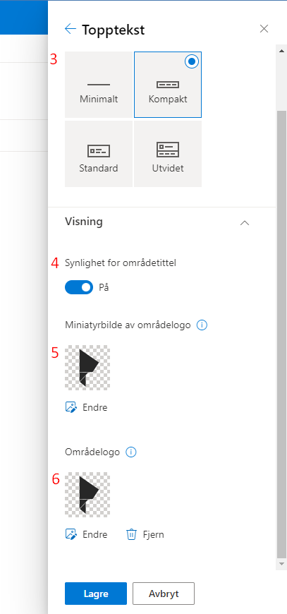

#  Slik endrer du områdeikon på portefølje- og prosjektområde

Områdeikonet for porteføljenivået og prosjektområdet kan endres av områdets eier/ områdeadministrator. Fremgangsmåten er lik både for portefølje- og prosjektnivå, derfor gjelder informasjonen under for begge.

Ikonet endres enkelt ved hjelp av disse stegene:

1.  Trykk på tannhjulet øverst i høyre hjørne og velg
*Endre utseendet*:
 
2.  Velg *Topptekst* for å endre, sette inn eller fjerne områdelogo.
3.  Du kan velge format på toppteksten. Standard er den satt til *Kompakt* 
4.  *Synlighet for områdetittel* gir deg muligheten til å vise og skjule toppteksten.
5.  *Miniatyrbilde av områdelogo*, miniatyrbilde for område logo som vises i søk, på område kortet og hvor andre enn kvadratisk logo er nødvendig.
6.  *Områdelogo*, logo som vil vises i toppteksten for området, som kan være gjennomsiktig eller ikke-gjennomsiktlig.

> Trykk *Lagre* for å lagre endringene.