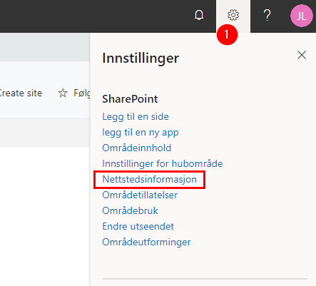

#  Slik endrer du områdeikon på portefølje- og prosjektområde

Områdeikonet for porteføljenivået og prosjektområdet kan endres av
områdets eier/ områdeadministrator. Fremgangsmåten er lik både for
portefølje- og prosjektnivå, derfor gjelder informasjonen under for
begge.

Ikonet endres enkelt ved hjelp av disse stegene:

1)  Trykk på tannhjulet øverst i høyre hjørne og velg
    *Nettstedsinformasjon*:
    
     

2)  Velg *Endre* under *Logo for område* for å sette inn eller endre
    logo som skal vises på området

3)  Under *Områdenavn* angir du det navnet som skal vises på området.

4)  *Områdebeskrivelse* er en mer utfyllende tekst for området.

5)  *Personverninnstillinger,* her angir du hvilken tilgangsstyring som
    skal gjelde for området. Hvis dette er på porteføljenivå, vil
    innstillingen du velger ikke gjelde
    for prosjektene som blir opprettet under porteføljen. Prosjektene
    vil ha selvstendig kontroll på dette.

6)  Trykk *Lagre* for å lagre endringene.

1.  https://support.microsoft.com/nb-no/office/deling-og-tillatelser-ac85fbf1-2431-49bf-8690-f1a2b98af65f?ui=nb-NO\&rs=nb-NO\&ad=NO
