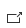

# Porteføljenivå

Porteføljenivået gir god oversikt over alle prosjektene i porteføljen. I denne oversikten kan du følge status på prosjekter, utvikling i gevinstrealisering og annen nøkkelinfo om prosjekter.

Det er i porteføljenivået at standarddokumenter, standardoppgaver, standardinteressenter og standard fasesjekkpunkter blir vedlikeholdt.

## Forsiden

På forsiden får du en oversikt over tilgjengelige prosjekter med
nøkkelinfo om hvert prosjekt. Her kan du også opprette nye prosjekter.

Prosjektet må være ferdig konfigurert for at prosjektkortet vises på forsiden.

     

1)  Toppnavigasjon: Denne tar deg til forsiden i Prosjektportalen 365 eller direkte til ulike funksjoner i porteføljeområdet.

2)  Ikon for denne installasjonen av Prosjektportalen. Dette kan
    tilpasses av administrator.

3)  Opprett nytt prosjekt ved å trykke på «Opprett område».
    Tilgangen til å opprette nye prosjekter styres på porteføljenivå.

4)  Prosjektoversikt med mulighet for å søke på alle prosjekter i
    porteføljen som man har tilgang på. Her vises prosjektkort som
    lenker til prosjektet og viser prosjektets fase, prosjektleder og prosjekteier. Trykk på  nederst til venstre i hvert prosjektkort for å se ytterligere prosjektinformasjon.

    **Mine prosjekter** - Her vises alle prosjekter hvor du er medlem.

    **Alle prosjekter** - Her vises alle prosjekter i miljøet. Prosjekter hvor du ikke er medlem vil være grået ut, og utilgjengelig for deg.

    **Overordnede områder** - Viser alle overordnede områder i miljøet.

    **Program** - Her vises alle programområdene i miljøet.

    
5)  Siste prosjekter gir oversikt over de siste prosjektene som er blitt opprettet i Prosjektportalen. Du ser bare prosjekter som du har tilgang til.

6)  Nyheter viser artikler som er publisert på prosjektområdene.

I tillegg er det et område for lenker nederst på siden. Lenker kan
brukes til å peke til nyttige områder eller dokumenter som er
relevante for brukere av Prosjektportalen. Lenkene vises for alle
brukere som har tilgang til porteføljenivået.