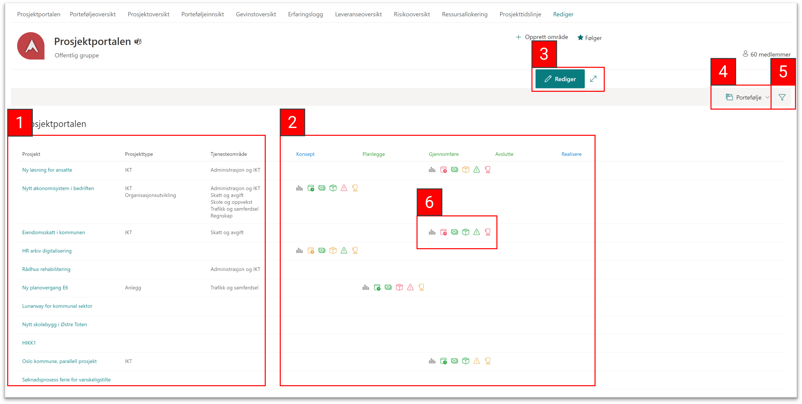

# Prosjektoversikt

Prosjektoversikt gir en oversikt over alle prosjektene på tvers av porteføljer. Du kan legge til eller velger porteføljer og filtrere per tjenesteområde eller ved prosjekttype. I oversikten ser du Prosjektnavn, Prosjekttype, Tjenesteområde og hvilken fase prosjektet er i. Under prosjektfase (Konsept, Planlegge, Gjennomføre, Avslutte, Realisere) ser man ikoner som gir en visuell oversikt over prosjektstatus, ved a flyttemuspekeren over ikoner får man opp mer detaljer.

1. **Prosjektoversikt:** Har ser man Prosjekt, Prosjekttype og Tjenesteområde. Flytt muspeker over Prosjektnavn i første kolumne til å se [mer detaljer om prosjektet](#prosjektoversikt-1).

2. **Prosjektfasen:** Har ser man hvilken fase prosjekt er i. Fase ikonene (ser **6. Fase ikoner** under) står under prosjektfase som er pågående.

3.  **Rediger visning:** Har kan man endre bredde for statuskolonner og andre innstillinger.
 
4. **Portfølje meny:** Bytt mellom porteføljer eller legg til porteføljer. Har kan man bytte mellom Porteføljer eller legg til porteføljer. [Les mer under](#portefølje-meny)

5. **Filtrering:** Har kan man filtrere ved *Tjenesteområde* eller *Prosjekttype*. [Ser under for skjermbilder](#filtrering-1)

6.  **Fase ikoner:** Ikoner som gir et øyeblikkelig oversikt over prosjektstatus. [Flytt muspeker over for mer informasjon.](#fase-ikoner)

## Undermenyer og skjermbilder av funksjoner
#### Prosjektoversikt
Ved å flytte muspekeren over Prosjektnavn i første kolumne får mann opp en nyttig oversikt over prosjektet. Ser illustrasjon under.

                                       
                                      
#### Filtrering
Ved å trykke på Filtrering ikonet kan man filtrere ved Tjenesteområde og Prosjekttype.

 

#### Fase ikoner
Når man flytter muspeker over *Fase ikoner* får man opp en mer detaljert boks med mer detaljer fra prosjektet.

 

#### Portefølje meny
Ved å trykke på Portefølje menyen kan men velge mellom Porteføljer. Det er mulig å legge til flere Porteføljer, trykk på **Administrer porteføljer** å åpne porteføljelisten (ser bildet under). Trykk på **Ny** og etterpå **Element** til å legge en Portefølje til.

 

**Legg til ny list Element i portefølje meny**

