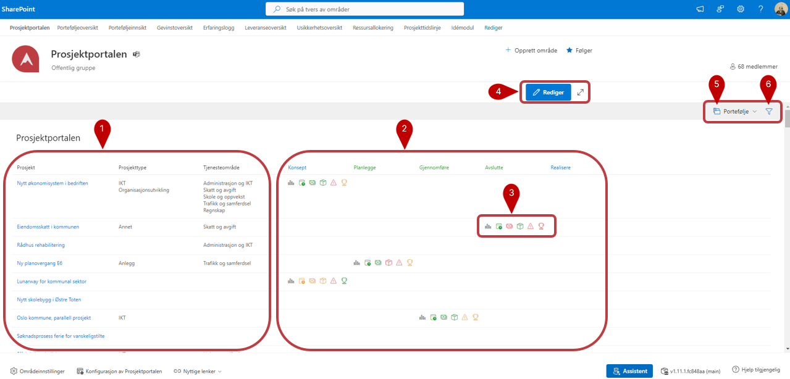
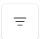
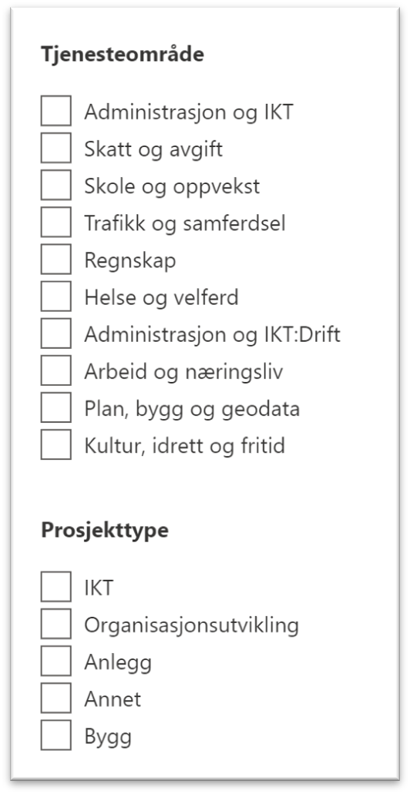
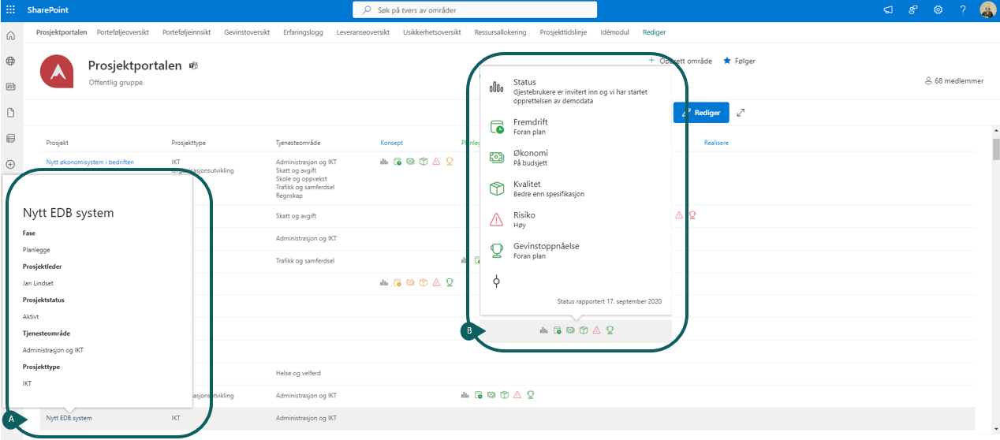
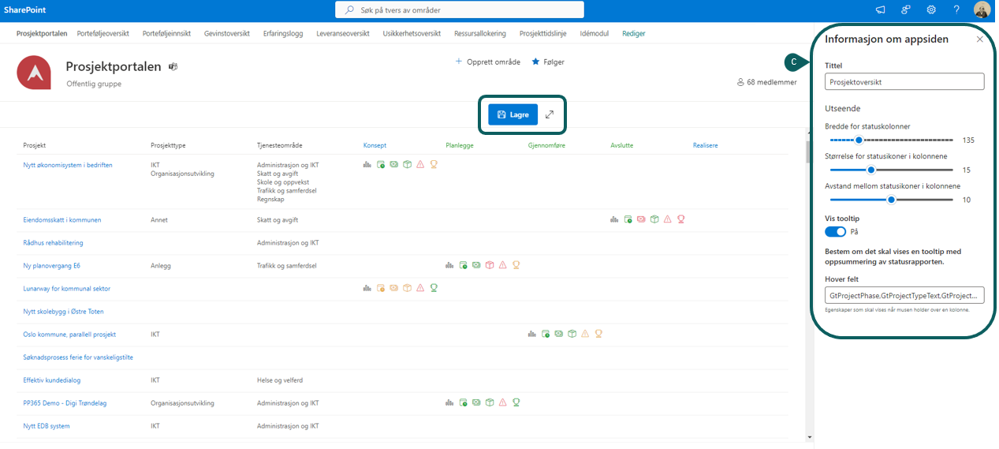
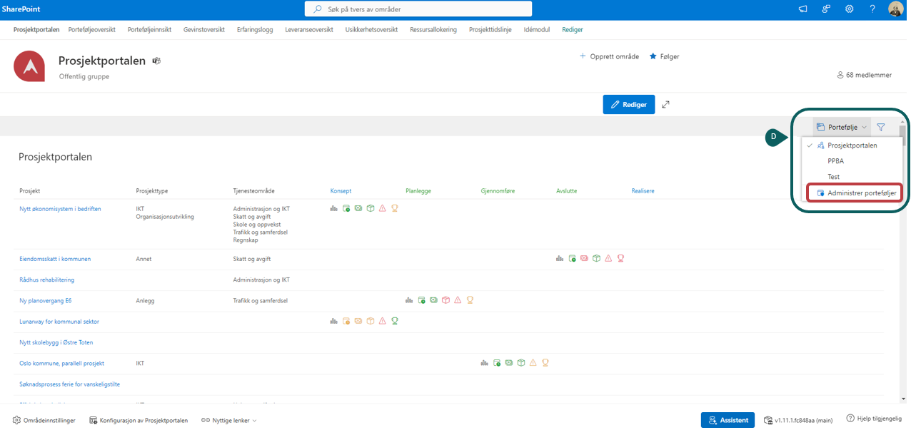
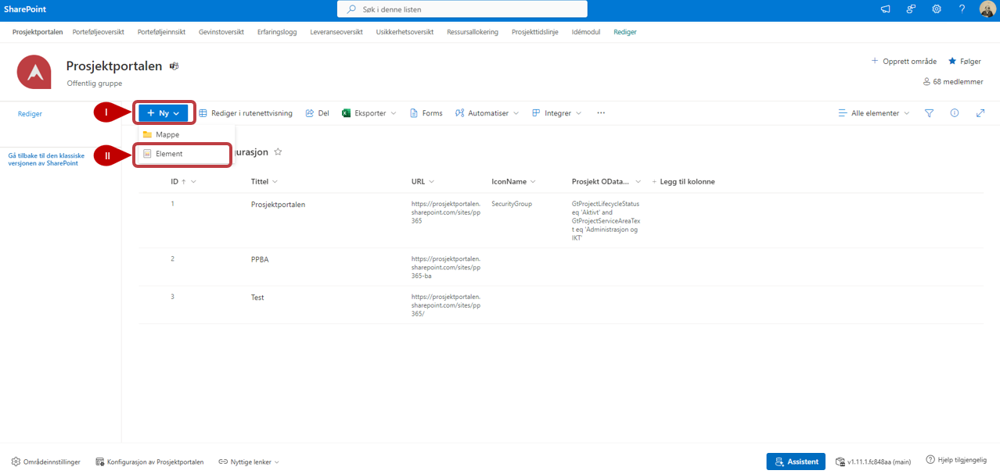

  

# Prosjektoversikt

Prosjektoversikt gir en oversikt over alle prosjektene på tvers av porteføljer.

1. **Prosjektoversikt:** Her ser du en oversikt over prosjekter, hvilken prosjekttype og tjenesteområde prosjektet tilhører. [Se bilde og mer info under (A)](#a-prosjektoversikt-og-b-status-ikoner).

2. **Prosjektfase:** Her ser du hvilken fase prosjektene er i.
3. **Status ikoner:** Disse ikonene gir en visuell og øyeblikkelig oversikt med status for prosjekter i pågående fase. [Se bilde og mer info under (B)](#a-prosjektoversikt-og-b-status-ikoner).

4. **Rediger visning:** Her kan man endre bredde for statuskolonner og andre innstillinger. [Se bilde og mer info under (C)](#c-rediger-visning).

5. **Portfølje meny:** Her kan du administrere porteføljer du har tilgang til samt bytte til andre porteføljer. [Se bilde og mer info under (D)](#d-portfølje-meny).

6. **Filtrering:** Klikk på -knappen og du kan filtrere på *Tjenesteområde* eller *Prosjekttype*.

 

## Detaljert beskrivelse av punktene ovan

### A) Prosjektoversikt og B) Status ikoner

  **A)** Gjennom at holde muspekeren over prosjektnavnet i første kolumnen får man opp mer informasjon og detaljer om prosjektet.

  **B)** Hold muspekeren over statusikonene for å få mer detaljert informasjon om status på prosjektet

### C) Rediger visning

 **C)** Klikk på Rediger for å få opp en sidepanel der du kan redigere utseende på statusikoner så som bredde, størrelse og avstand.  
        Lagre dine endringer
  
  

### D) Portfølje meny

  **D)** Ved å trykke på ***Portefølje*** kan du bytte mellom ulike porteføljer. Det er mulig å legge til flere porteføljer, trykk på **Administrer porteføljer** for å åpne porteføljelisten.

  
  ***For å legge til ny portefølje:***

   ***I)  Trykk på Ny***

   ***II) Trykk på **Element** og legg inn ny portefølje.***

   
