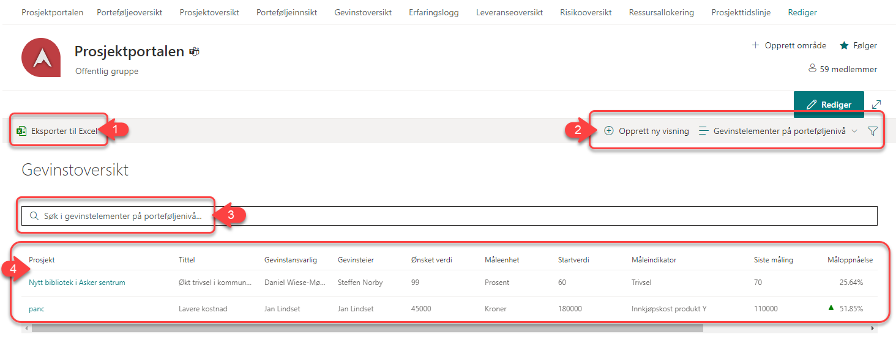

# Gevinstoversikt

Alle prosjektområder har egne verktøy for gevinstrealisering. I
gevinstoversikten finner du oversikt og oppsummering over dette for de prosjektene du har tilgang til.

1.  - Knappen benyttes for å eksportere listen til Excel. Hvis du har filtrert listen for å se på spesifikke prosjekter, er det kun de du ser som vil bli eksportert ut. Pass derfor på at eventuell filtrering er i tråd med det du ønsker å eksportere, og tilbakestill filtre om du ønsker å eksportere en oversikt over samtlige prosjekt.

2. Bruk søkefeltet for å finne gevinster på bakgrunn av alle tilgjengelige felter.
   
3. Lar deg opprette egne visninger, velge mellom eksisterende og filtrere visningene basert på tilgjengelige felter.

4. I denne delen finner du selve oversikten:
    
    - Hver linje er en gevinst, du kan også gå til gevinsten i prosjektrommet ved å trykke på tittelen til gevinsten.
    
    - Ved å klikke på kolonneoverskriften kan du velge å gruppere på enkelte kolonner. (Hvilke kolonner du kan gruppere på er styrt av oppsettet av ‘Prosjektkolonner’ som du finner igjen i
    menyvalget *Konfigurasjon av Prosjektportalen* i *Områdeinnstillinger* på porteføljenivå*)*
    
    - Negativ eller positiv utvikling i måloppnåelse vil indikeres med røde eller grønne triangler.
    
    - Helt til høyre på hver enkelt gevinstlinje kan du velge å vise
    målingene som ligger til grunn på den enkelte gevinst:
    
    
