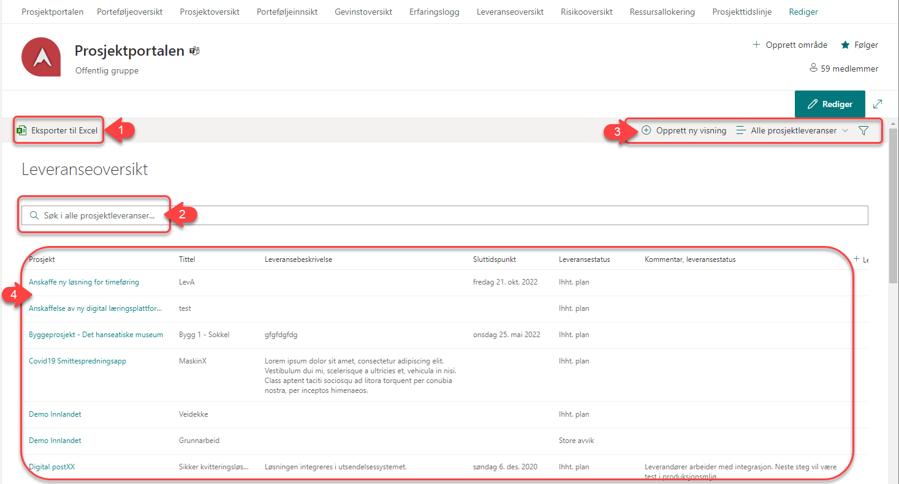
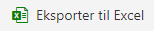

# Leveranseoversikt

Leveranseoversikten viser alle leveranser fra alle prosjekter. Det er kun leveranser fra de prosjekter du har tilgang til som er synlige for deg. For å endre på innholdet i Leveranseoversikten henviser vi til manualen for administratorer av Prosjektportalen.

1.  - Knappen benyttes for å eksportere listen til Excel. Hvis du har filtrert listen for å se på spesifikke prosjekter, er det kun de du ser som vil bli eksportert ut. Pass derfor på at eventuell filtrering er i tråd med det du ønsker å eksportere, og tilbakestill filtre om du ønsker å eksportere en oversikt over samtlige prosjekt.

2. Bruk søkefeltet for å finne leveranseelementer på bakgrunn av alle tilgjengelige felter.
   
3. Lar deg opprette egne visninger, velge mellom eksisterende og filtrere visningene basert på tilgjengelige felter.

4. Leveranseelementer fra de prosjektene som du har tilgang til vises i dette feltet. Ved å trykke på prosjektnavnet til den enkelte leveranse vil du bli sendt til tilhørende prosjektområde.
