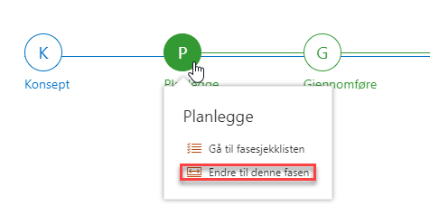

# Prosjektegenskaper og fasesetting

1)  Det første du bør gjøre er å redigere egenskapene til prosjektet og
    fylle inn relevant prosjektinformasjon ved å trykke på *Rediger
    egenskaper* i feltet *Prosjektinformasjon:*
    
    

2)  Fyll ut feltene med relevant informasjon om prosjektet. Legg merke
    til at noen av feltene har en stjerne ved navnet. Disse er
    obligatoriske å fylle ut, og du får ikke lagret
    prosjektinformasjonen før det er gjort.

3)  Gå til bunnen av siden og trykk på Lagre når du er ferdig med å
    fylle inn informasjon. Denne informasjonen bør vedlikeholdes
    underveis i prosjektet. Denne informasjon vedlikeholdes i prosjektet
    og er synlig på porteføljenivå for de som har tilgang til
    prosjektet.

4)  Velg deretter hvilken fase prosjektet befinner seg i ved å peke over
    ønsket fase i faseviseren og trykke på *Endre til denne fasen.*
    
    

5)  Når fase er valgt vil man bare se dokumenter som er knyttet opp mot
    den gjeldende fasen.