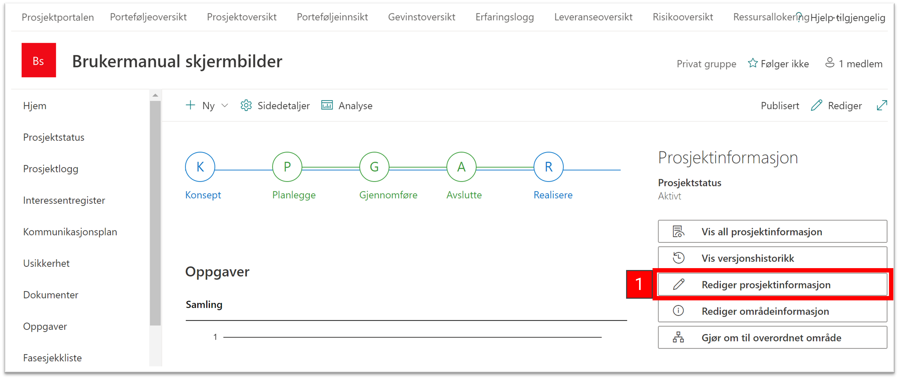

# Prosjektinformasjon og fasesetting

1)  Det første du bør gjøre er å redigere egenskapene til prosjektet og fylle inn relevant prosjektinformasjon ved å trykke på *Rediger prosjektinformasjon* i feltet ***Prosjektinformasjon***

2)  Fyll ut feltene med relevant informasjon om prosjektet. Legg merke til at noen av feltene har en stjerne ved navnet. Disse er
obligatoriske å fylle ut, og du får ikke lagret prosjektinformasjonen før det er gjort.

3)  Hvis en Felt har en "Legg til merke" ikon  kan du trykke på ikonet å velge fra en termliste.

4)  Gå til bunnen av siden og trykk på Lagre når du er ferdig med å fylle inn informasjon. Denne informasjonen bør vedlikeholdes underveis i prosjektet. Denne informasjon vedlikeholdes i prosjektet og er synlig på porteføljenivå for de som har tilgang til prosjektet.

5)  Velg deretter hvilken fase prosjektet befinner seg i ved å peke over ønsket fase i faseviseren og trykke på ***Endre til denne fasen***

5)  Når fase er valgt vil man bare se dokumenter som er knyttet opp mot den gjeldende fasen.

# Gjør om til overordnet område

Et område kan gjøres om til et overordnet området, hvor du kan knytte flere underområder til det overordnede området. Dette oppsett passer, for eksempel til prosjekter med flere underprosjekter. Et område kan ikke reverseres tilbake når det først har blitt gjort om til et overordnet området.

1)  Trykk på *Gjør om til overordnet område* i feltet **Prosjektinformasjon**
