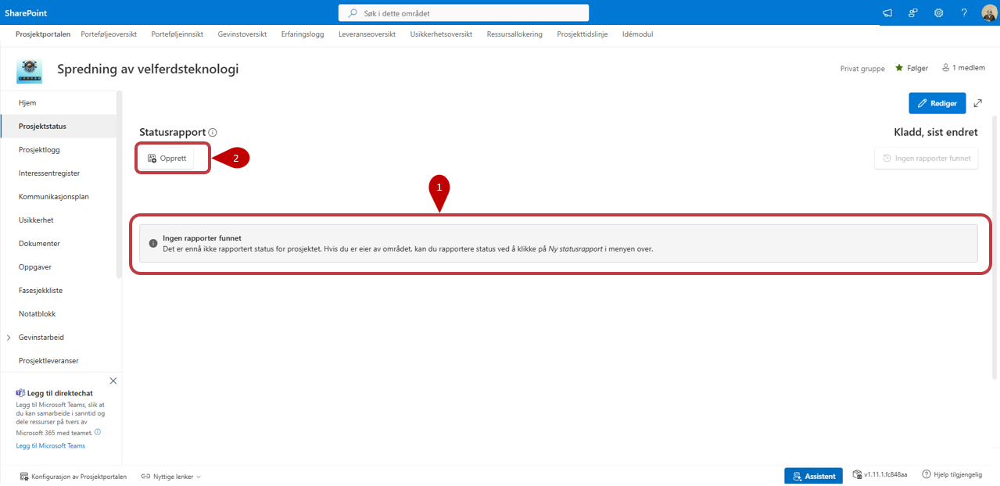
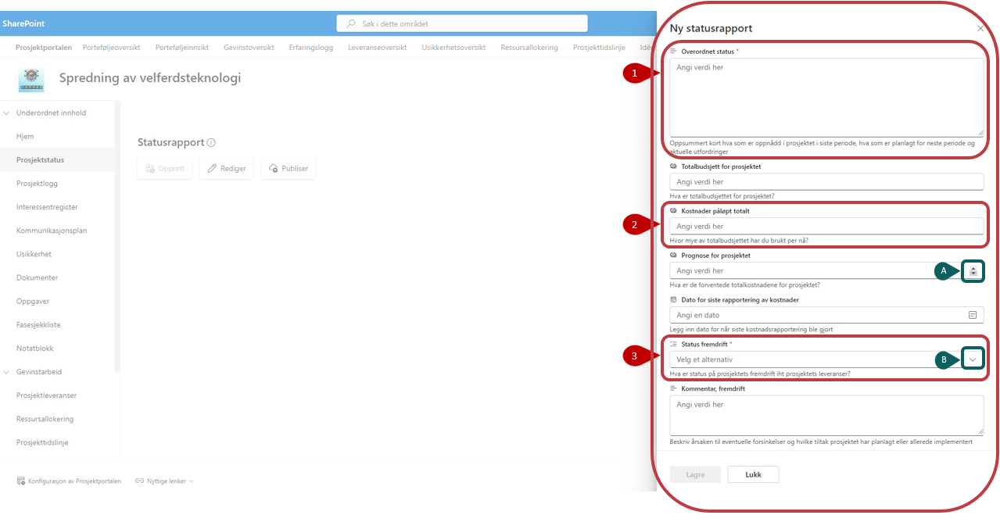
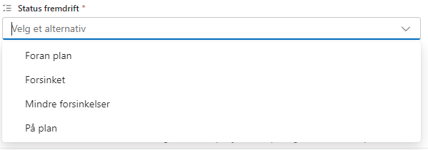
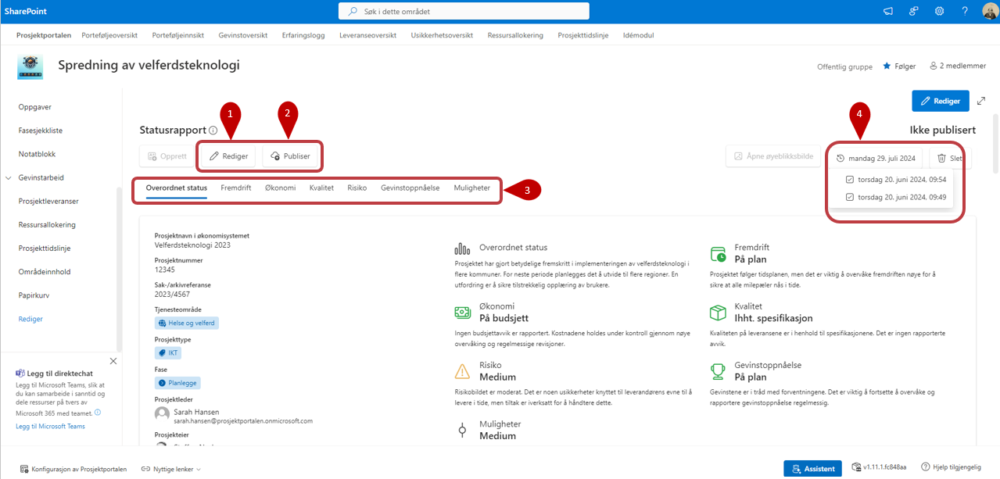
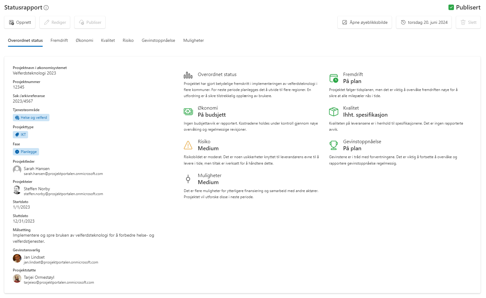
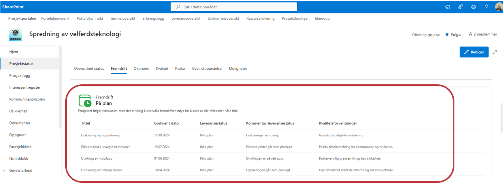
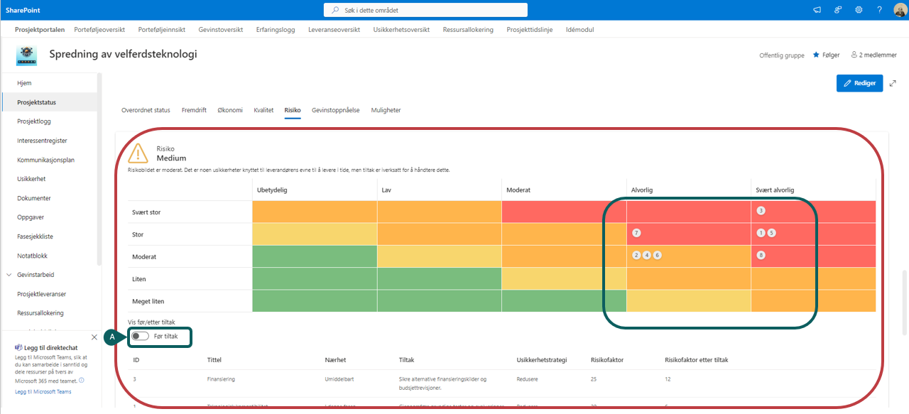
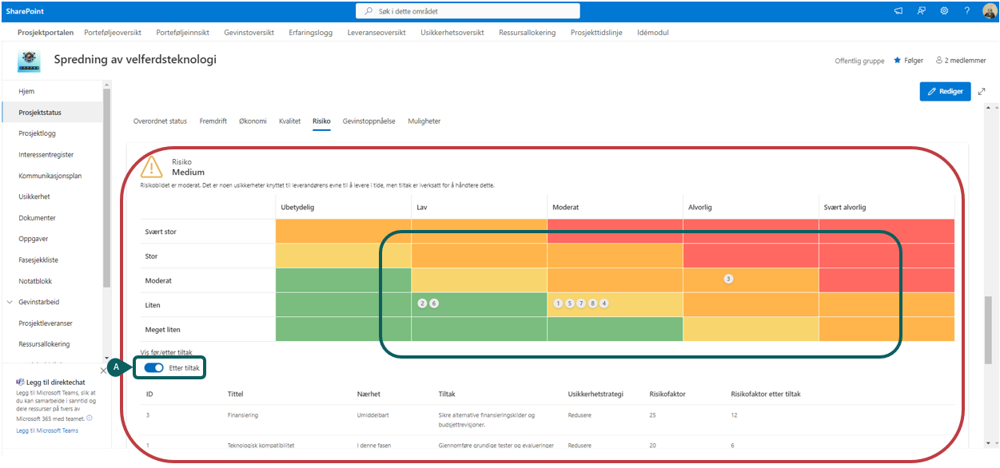

# Prosjektstatus

Prosjektstatus er en sammenstilling av informasjon om prosjektet, hvor noe rapporteres inn gjennom statusrapportene direkte, mens annet hentes fra prosjektinformasjonen. Oversikten gir deg en visuell fremstilling på nåværende status og fremgang i prosjektet.

1. Før første statusrapport er opprettet vil vinduet se ut som bildet under.
2. For å opprette ny statusrapport klikker du på **"Opprett"**

    

## Opprette en statusrapport

Når du klikket på "Opprett" åpnes en panel på høyre siden og du vil bli presentert for alle de feltene som skal innrapporteres. 

Alle felter som er markert med en stjerne må være utfylt for at du skal få lagret rapporten. ***Mer forklaring under bilde!***

Rapporten innholder felt som har forskjellige verdier som:
1. Fritekstverdier som **Overordnet status** og alle **Kommentar**-felt som tilhører statusfeltene
2. Tallverdier - På disse felt kan du skrive inn tall direkte eller velge pilene for å legge inn verdier. Dette gjelder disse felt:
    - **Totalbudsjett for prosjektet**
    - **Kostnader påløpt totalt**
    - **Prognose for prosjektet**
      
     
     **A.** Ved å holde muspekeren inne i feltet får du opp disse piler som lar deg legge inn tall 

3.  Forhåndsdefinerte verdier - I disse feltene kan du velge mellom et antall forhåndsdefinerte verdier. Det gjelder alle statusfeltene :
    - **Status fremdrift**
    - **Status Økonomi**
    - **Status kvalitet**
    - **Status risiko** [(mer informasjon om rapporten under Usikkerhet)](https://docs.puzzlepart.com/prosjektportalen-manual/Brukermanual/4%20Prosjekt/4.6-Usikkerhet.html)
    - **Status muligheter**
    - **Status gevinstoppnåelse**
  

  
    **B.** Klikke på pilen for å få se på verdiene som er tilgjengelige og er definert på forhånd
    
      

   ***For alle statusfelt er også mulig å legge til egne kommentarer der det er behov for å utdype med mer detaljer. Dette gjør du i kommentarfeltet under av hver seksjon***

## Lagre, redigere og publisere en statusrapport

Når du har fylt i hele statusrapporten kan denne lagres. Rapporten vil da bli presentert grafisk på skjermen. Du kan nå se over rapporten og gjøre eventuelle endringer ved å trykke på

 

1. **Rediger status** dersom det er noe som skal endres på.

2. Når du er fornøyd med rapporten velger du **Publiser**, og rapporten blir lagret og skrivebeskyttet. Data fra rapporten blir gjort tilgjengelig for Porteføljeområdet.

   Det er bare data fra den siste *publiserte* rapporten som blir vist på Porteføljenivå.
3. Knappene gir deg mulighet at komme lenger ned på siden og få enda mer detaljert informasjon for hver status. 
   
4. Tidligere statusrapporter finner du igjen i nedtrekks-menyen på høyre side.

## Statusrapporten i visningsmodus

Du finner statusrapporten i venstremenyen. Når du klikker deg inn vil du se rapporten i visningsmodus, og den ser slik ut:

## Prosjektdata og annet dynamisk innhold i statusrapporten
### Fremdrift

Informasjon om leveranser i prosjektet vil bli inkludert i statusrapporten dersom slike finnes.

### Risiko
Risikoer vil også bli indikert i en risikomatrise dersom det er registrert risikoer i prosjektet. Her synliggjøres alle Usikkerheter som er registrert og har status som ***Identifisert***.

  **A)** Ved å trykke på **Vis før/etter tiltak** knappen under diagrammene kan man se en visuell representasjon av risikoer før eller etter tiltak basert på informasjon skrevet inn under usikkerheter som legges in.

***Risikoer før tiltak***

***Risikoer etter tiltak***

