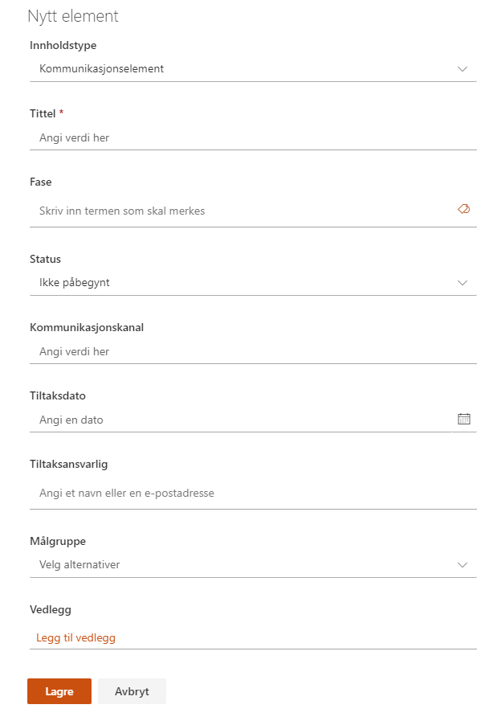

# Venstremenyen – alle verktøy og funksjoner

I de neste underkapitlene går vi punktvis gjennom alle verktøy og
funksjoner som er tilgjengelige i venstremenyen i prosjektet.

## Hjem

Dette er lenken du kan benytte for alltid å komme tilbake til
prosjektets hjemmeside.

## Prosjektstatus

Prosjektstatus er en sammenstilling av informasjon om prosjektet, hvor
noe rapporteres inn gjennom statusrapportene direkte, mens annet hentes
fra prosjektinformasjonen. Oversikten gir deg en visuell fremstilling på
nåværende status og fremgang i prosjektet.

Før første statusrapport er opprettet vil vinduet se ut som bildet
under.

### Opprette en statusrapport

Du oppretter statusrapporten ved å klikke på *Ny statusrapport*. Nå vil
du bli presentert for alle de feltene som skal innrapporteres. Alle
felter som er markert med en stjerne må være utfylt for at du skal få
lagret rapporten.

Noen felt i rapporten er fritekst, eller tallverdier, og andre har
forhåndsdefinerte verdier, som vist i bildet til høyre med *Status
fremdrift* .

I tillegg til *Status fremdrift* har du seksjoner for:

  - Status økonomi

  - Status kvalitet

  - Status risiko

  - Status gevinstoppnåelse

Det er også mulig å legge til egne kommentarer der det er behov for å
utdype med mer detaljer. Dette gjør du i kommentarfeltet i bunnen av
hver seksjon.

### Lagre, redigere og publisere en statusrapport

Når du har fylt i hele statusrapporten kan denne lagres. Rapporten vil
da bli presentert grafisk på skjermen. Du kan nå se over rapporten og
gjøre eventuelle endringer ved å trykke på *Rediger status* dersom det
er noe som skal endres på.

Når du er fornøyd med rapporten velger du *Publiser*, og rapporten blir
lagret og skrivebeskyttet. Data fra rapporten blir gjort tilgjengelig
for Porteføljeområdet.

 

Det er bare data fra den siste *publiserte*
rapporten som blir vist på Porteføljenivå.

Tidligere statusrapporter finner du igjen i nedtrekks-menyen på høyre
side.

### Statusrapporten i visningsmodus

Du finner statusrapporten i venstremenyen. Når du klikker deg inn vil du
se rapporten i visningsmodus, og den ser slik ut:

### Prosjektdata og annet dynamisk innhold i statusrapporten

Informasjon om leveranser i prosjektet vil bli inkludert i
statusrapporten dersom slike finnes.

Risikoer vil også bli indikert i en risikomatrise dersom det er
registrert risikoer i prosjektet.

## Prosjektlogg

Prosjektloggen brukes som et verktøy for å registrere og samle
erfaringer i ett prosjekt. Lista kan knyttes opp mot prosjektleveranser,
slik at man kan spore hvilke leveranser det er registrert erfaringer på.

Det er definert 4 ulike kategorier (kalt *Loggelement* i listen)*:*

  - Kommentar/Bekymring/Hendelse

  - Endringsforespørsel

  - Avvik fra spesifikasjon

  - Beslutning

Feltet *Meldt av* er et person-felt hvor du kan oppgi hvem som har meldt
saken.

Feltet *Ansvarlig* er et felt med forhåndsdefinerte verdier og benyttes
som et sorteringselement. De forhåndsdefinerte verdiene for dette feltet
er Prosjekteier, Linjeorganisasjon, Prosjektleder, Prosjektgruppe,
Leverandør, Referansegruppe og Andre.

De elementer som er av betydning for andre prosjekter, kan gjøres
tilgjengelig for Porteføljenivået ved å slå på bryteren *Til
erfaringsloggen = Ja.*

Feltet *Aktører* har forhåndsdefinerte verdier (Leverandører,
Prosjektstyre, Prosjektgruppe, Referansegruppe og Andre interessenter).
Man kan velge en eller flere av disse.

Om ønskelig kan du koble elementet til en leveranse med feltet *Påvirker
leveranse*. Det velges da fra listen *Prosjektleveranser*.

Vedlegg kan legges til på enkelt elementer. Merk at disse vedleggene vil
bare bli lagret i denne listen, og blir ikke vist i dokumentbiblioteket.

## Interessentregister

Interessentregisteret brukes til å organisere og dokumentere
interessenter som påvirkes av, eller som kan påvirke, prosjektet.

*Interessentgruppe* er et felt med forhåndsdefinerte verdier. Verdier i
denne listen er:

  - Medarbeidere

  - Ledelse

  - Innbyggere

  - Næringsliv

  - Frivillighet/Organisasjon

  - Fagforening

  - Andre offentlige aktører

  - Akademia

  - Virkemiddelapparat

  - Brukere

Vedlegg kan legges til på enkelt elementer. Merk at disse vedleggene
bare vil bli lagret i denne listen, og blir ikke vist i
dokumentbiblioteket.

I noen tilfeller vil det være en standardliste med interessenter som er
relevante for de fleste prosjekter. Disse kan vedlikeholdes på
porteføljenivå og genereres ved opprettelse i nye prosjekter.

## Kommunikasjonsplan

Kommunikasjonsplanen brukes til å planlegge og utføre alt av
kommunikasjon i og rundt prosjektet.

Hvert enkelt kommunikasjonselement kan knyttes til en fase i prosjektet.

Status kan settes ut fra de forhåndsdefinerte verdiene:

  - Ikke påbegynt

  - Påbegynt

  - Fullført

  - Utsatt

Målgruppe kan hentes ut fra interessentregisteret, hvor det også ligger
mer informasjon rundt interessenten. Det kan velges flere målgrupper for
hvert enkelt kommunikasjonselement.

Vedlegg kan legges til på enkelt elementer. Merk at disse vedleggene
bare lagres i denne listen, og blir ikke vist i dokumentbiblioteket.

## Usikkerhet

Usikkerhetslista lar prosjektdeltagere loggføre alle
usikkerhetselementer som har oppstått, eller som har risiko for å
oppstå, i løpet av et prosjekt.

Usikkerheter kan registreres som ***Mulighet*** eller ***Risiko*** og
knyttes til fase i prosjektet.

Ved å trykke på tittelen på lista eller *Usikkerhet* i venstremenyen ser
du alle usikkerheter, uavhengig av fase.

Usikkerheter som er registrert og har status som ***Identifisert*** vil
synliggjøres i [Prosjektstatus](#hjem) under ***Risiko**.*

Når det legges inn en ny usikkerhet, er det en
mengde data som legges inn på den aktuelle risiko eller mulighet. Det er
de samme dataene som er aktuelle for både risiko og muligheter.

Usikkerheten kan knyttes opp mot en prosjektfase om ønskelig.

Dataverdien *Nærhet* har følgende forhåndsdefinerte verdier:

  - Umiddelbart

  - I denne fasen

  - Innenfor prosjektet

  - Utenfor prosjektet

*Usikkerhetsstrategi* har disse forhåndsdefinerte verdiene:

  - Redusere

  - Overvåke

  - Unngå

  - Overføre

  - Dale

  - Akseptere

  - Øke

  - Utnytte

Bryteren *Vis i portefølje* gjør det mulig å vise den aktuelle risikoen
i Risikooversikten på Porteføljenivå.

Vedlegg kan legges til på enkelt elementer. Merk at disse vedleggene
bare lagres i denne listen, og blir ikke vist i dokumentbiblioteket.

## Dokumenter

SharePoint og Prosjektportalen har fantastiske verktøy for å dele,
skrive sammen på og vedlikeholde prosjektdokumenter. Dette avsnittet tar
for seg grunnleggende dokumenthåndtering. For mer informasjon om
dokumenthåndtering gå til Microsoft sine egne supportsider\[1\].

### Dokumentvisning på forsiden av prosjektområdet

På forsiden av prosjektområdet er det bygget inn
en visning av prosjektdokumenter. Denne visningen fremstiller
dokumentene basert på det som heter «standard visning». En god praksis
kan være å la visningen «Gjeldende fase» stå som «standard visning», på
denne måten er det dokumenter tilknyttet den fasen prosjektet er i som
vises på prosjektets hjemmeside.

Hva som skal være standardvisning kan defineres i dokumentbiblioteket
ved å bruke visningsmenyen på høyre side.

Alle dokumentene i prosjektet ligger i dokumentbiblioteket, som er
tilgjengelig i venstremenyen med tittelen "Dokumenter".

Når prosjektet ble opprettet var det et valg for å legge et sett med
standarddokumenter fra Porteføljeområdet inn i prosjektet. Disse er som
regel allerede knyttet opp mot ulike faser i prosjektet. I tillegg kan
deltakerne selv legge til, fjerne og redigere dokumenter i
prosjektområdet.

### Laste opp dokument(er) i prosjektområdet

I tillegg til å legge inn standarddokumenter ved opprettelse av
prosjektet, er det flere metoder som kan benyttes for å få dokumenter
inn i et prosjekt på:

1)  Hent dokumentmal

2)  Ny knappen

3)  Dra-og-slipp-metoden

4)  Last opp-knappen

Vi beskriver disse kort i denne manualen, med fokus på *Hent
dokumentmal* som er en spesialtilpasset metoden for Prosjektportalen.

Det kan være begrensninger på enkelte av funksjonene. Dette gjelder
forhold som styres fra sentralt hold og som Prosjektportalen dermed ikke
kan overstyre. I tillegg kan du oppleve at nettlesere oppfører seg noe
ulikt.

#### Hent dokumentmal

Med denne funksjonen er det dokumentene som ligger i *Malbiblioteket* på
Porteføljenivå som benyttes som kilde. Ved å trykke på *Hent
dokumentmal* får du en oversikt over dokumentmalene som ligger der.

Her vil det alltid være siste utgave av malen som blir tatt med over til
prosjektet. Dette er med på å styrke samhandlingen rundt bruk av maler,
og sikre at man til enhver tid arbeider med siste mal.

Disse malene vil også allerede kunne være merket med relevant
prosjektfase.

#### Ny-knappen

Med "Ny"-knappen kan du opprette et nytt dokument i dokumentbiblioteket.
Hva slags dokumenter du kan opprette er styrt av prosjektområdets
innholdstyper.

#### Dra-og-slipp-metoden

Har du dokumenter liggende på en filkatalog eller som vedlegg i en epost
er det lett å kopiere disse rett inn i dokumentbiblioteket ved å markere
de i systemet de ligger, og kort og greit dra-og-slippe dem inn i
dokumentbiblioteket. 

#### Last opp-knappen

Du kan også benytte deg av "Last opp"-knappen som ligger i toppmenyen i
dokumentbiblioteket. Her blar du deg frem til de aktuelle dokumentene på
din egen PC, og velger disse for opplasting.

Dokumentene du laster opp blir ikke flyttet, men kopiert inn i
biblioteket.

### Redigere egenskapene til et dokument

Du kan redigere egenskapene til et dokument. Om du ønsker å (for
eksempel) endre fase på et dokument kan du gjøre dette på flere måter
direkte i biblioteket:

| Funksjon         | Beskrivelse                                                                                                                        |
| ---------------- | ---------------------------------------------------------------------------------------------------------------------------------- |
| Hurtigredigering | Bruk dette valget for å gjøre endringer direkte i dokumentlisten. Husk å avslutte hurtigredigering etterpå for å lagre endringene. |
| Ellipsemenyen    | Velg *Mer* og så *Egenskaper* for å åpne egenskapsvinduet, og rediger etter behov.                                                 |
| Detaljruten      | Marker et dokument i listen. Dette åpner detaljruten på høyre side . Her kan du velge *Rediger alle.*      |

### Versjonslogg

Versjonsloggen er et fantastisk verktøy som gir
deg kontroll over ulike versjoner av et dokument uten at det tar opp
ekstra plass, og uten behov for å kalle dokumentet "versjon 1.0, 2.0,
3.0" osv.

For hver lagring som blir gjort, blir en ny versjon av dokumentet
opprettet automatisk. Ved samskriving skjer dette omtrent hvert minutt.

Du finner versjonsloggen i ellipsemenyen til dokumentet. Menyen er
tilgjengelig to steder når du har markert et dokument. Du kan også
høyreklikke over dokumentet.

I versjonsloggen kan du se på tidligere versjoner ved å trykke på dato
og tidspunkt i "Endret"-kolonnen, eller gjenopprette tidligere versjoner
ved å trykke på nedtrekkspilen som du ser hvis du drar musepekeren over
en versjon (markert med rød boks).

Når du gjenoppretter en tidligere versjon, blir den nåværende versjonen
lagret i versjonsloggen.

### Slettede filer 

Dokumenter som slettes, havner i papirkurven. Dokumenter som ligger i
papirkurven kan gjenopprettes av den som slettet, eller eier av område i
løpet av 60-90 dager. Du kan lære mer om papirkurven i Microsoft sine
egne supportsider\[2\]. 

## Oppgaver

Prosjektportalen 365 benytter Microsoft Planner til oppgavestyring.

Oppgavelisten brukes til å lage, planlegge og delegere oppgaver i
prosjektet. Når du oppretter et nytt prosjektrom kan du velge å ta med
et sett med standardoppgaver inn til prosjektet. Prosjektportalen kommer
med samme oppgaveliste som Difis Prosjektveiviser. Dette kan tilpasses i
hver installasjon.  

### Oppgaver på prosjektets hjemmeside

På prosjektets hjemme side er det lagt inn en komponent som viser status
på oppgavene i prosjektet. Denne komponenten kan stilles inn til ulike
visninger, for å tilfredsstille behov i hvert enkelt prosjekt.

For å stille om til en annen visning:

  - Velg Rediger på prosjektets startside

  - Marker komponenten

  - Velg «Rediger nettdel» (blyantsymbolet)

  - Velg ønsket visning

  - Avslutt med «Publiser på nytt» på siden

Alle oppgavene og detaljer rundt disse finner du på prosjektets oppgave
side i venstremenyen.  
I Prosjektportalen 365 kan oppgaver også håndteres i Microsoft Planner.

### Oppgavesiden i prosjektet

På prosjektets oppgaveside vil du kunne bearbeide alle oppgaver i
prosjektet.

Typiske aktiviteter når du arbeider med oppgaver er

1.  Opprette ny oppgave i en samling

2.  Velg en oppgave for å komme inn på oppgavens detaljside (se neste
    kapittel)

3.  Vise/skjule fullførte oppgaver

4.  Opprette en ny samling

Du kan også betjene visningsområdet på siden med funksjonene:

  - Filter – Velg et filter du ønsker å benytte deg av
    
    Her kan du velge blant fritekst, forfaller, etikett, samling eller
    tildelt.

  - Gruppert etter – Her kan du velge hvilken gruppering du ønsker

### Oppbygning av oppgaver i Microsoft Planner

1)  > Tilordne – Her legger du inn navnet på den eller de som er
    > ansvarlig for oppgaven  
    > (kan være flere personer om ønskelig)

2)  > Samling – Med dette feltet kan du kategorisere oppgaver, for
    > eksempel etter fase.

3)  > Fremdrift – Angivelse av fremdriftsstatus på oppgaven

4)  > Sjekkliste – Kan benyttes til deloppgaver

5)  > Etiketter – Etiketter kan benyttes til å markere enkeltoppgaver
    > med farge/kode  
    > (kan benyttes til gruppering)

6)  
7)  > Kommentar – Dette er en logg for den enkelte saken, hvor de som
    > har saken tilordnet seg vil bli varslet pr epost når du trykker
    > *Send* 

8)  
9)  > Startdato – Planlagt tidspunkt for oppstart 

10) > Forfallsdato – Dato når oppgaven skal være løst

## Fasesjekkliste

Fasesjekklisten er et verktøy som lar prosjektdeltagere og prosjektleder
eller prosjekteier gå gjennom en forhåndsdefinert sjekkliste underveis i
eller ved endring av en fase i prosjektet. I noen prosjekter er ikke
alle sjekkpunkter like relevante. Dette avsnittet viser hvordan
sjekklisten fungerer, og hvordan du kan legge til, endre eller slette
sjekkpunkter i listen.

### Gjennomgang av sjekkpunkter ved endring av fase

I faseviseren på forsiden av prosjektet får du en indikasjon på hvor
mange sjekkpunkter som er utført ila hver fase ved å holde musepekeren
over en fase.

Når du har kommet til faseendring i prosjektet,
trykker du på *Endre til denne fasen* under den nye fasen (i bildet
under vil vi endre fra Konsept-fasen til Planlegge-fasen).

Nå vil Prosjektportalen kontrollere om fasesjekkpunktene i den fasen du
går fra er utført. Dersom alt er utført, vil du bli bedt om å bekrefte
at du vil bytte fase.

Dersom noen av fasesjekkpunktene ikke er utført,
vil en dialogboks åpne seg og du blir bedt om å besvare de gjenstående
fasesjekkpunktene.

Her er valgene *Utført*, *Ikke relevant*, *Hopp over alle* eller *Lukk*
(som lukker dialogboksen). For å kunne gå videre må du skrive en
kommentar hvis du velger noe annet enn *Ikke relevant*.

### Redigere prosjektets fasesjekkpunkter

Trykk på Fasesjekkliste i venstremenyen for å åpne den.

Trykk deretter på *Ny for å opprette et nytt fasesjekkpunkt*.

Fyll inn relevant innhold, inkludert *fasen*
sjekkpunktet tilhører. Husk å la status stå som *Åpen* hvis det er noe
som skal gjennomgås senere.

Eksisterende fasesjekkpunkter kan redigeres ved å markere et enkelte
element, og velge *Rediger.* Igjen, husk å la et fasesjekkpunkt stå som
*Åpen* dersom det er et punkt som skal bli tatt stilling til på et
senere tidspunkt

## Notatblokk

Notatblokken er en OneNote som er delt med alle som har tilgang til
prosjektet. Dette er et verktøy for å skrive og lagre fellesnotater,
inkludert møtenotater. Du kan lære mer om OneNote i Microsoft sine egne
supportsider\[3\]. 

## Prosjektleveranser

I dette verktøyet registreres og vedlikeholdes alle leveranser for
prosjektet. Alle leveranser kan knyttes opp mot målgrupper fra
interessentlisten.

### Legge til ny leveranse

Klikk på *Ny* i menyen.

Fyll inn skjemaet i henhold til leveransen og velg interessentgruppe fra
Interessent(er)-feltet hvis dette er relevant for en konkret målgruppe.

## Ressursallokering

Med *Ressursallokeringen* kan prosjektet sette opp de aktuelle
deltagerne i prosjektet.

Hver enkelt prosjektdeltager registreres med tiltenkt rolle, tidsperiode
og belastning i denne perioden.

Rolle som kan velges er ut fra de forhåndsdefinerte verdiene:

  - Prosjekteier

  - Prosjektleder

  - Innleid prosjektleder

  - Ass. Prosjektleder

  - Controller

  - Kvalitetsleder

  - Brukerkoordinator

  - Prosjektmedlem

  - IT-støtte

  - Konsulent

  - Rådgiver

  - Kundeservice

Denne rollelisten er administrert som et forvaltet termsett, og vil være
felles for alle prosjekter i en installasjon av Prosjektportalen.

## Øvrige valg i menyen

1)  Områdeinnhold
    
    Her finner du alle lister og bibliotek som er tilgjengelige i
    prosjektet. 
    
    

2)  Teams  

    I alle nye prosjekter vil du se en Teams-kobling helt nederst i
    venstre hjørne av menyen. Med denne koblingen kan du opprette et
    team som vil være tilgjengelig i Microsoft Teams-appen.  
      
    Etter at teamet er opprettet vil denne koblingen skjules og
    erstattes med menyvalget *Teams*, som legger seg inn mellom
    områdeinnhold og Papirkurv. Med dette menyvalget vil du kunne gå
    rett over i Microsoft Teams hvor du kan fortsette å arbeide mot
    prosjektet.

4)  Papirkurv  
    Her finner du alt du har slettet fra prosjektområdet, og kan
    gjenopprette elementer om du har slettet noe ved uhell. Områdeeier
    kan se alt som er slettet, og kan gjenopprette uavhengig om det ble
    slettet av noen andre. Du kan lære mer om papirkurven i Microsoft
    sine egne supportsider\[4\]. 