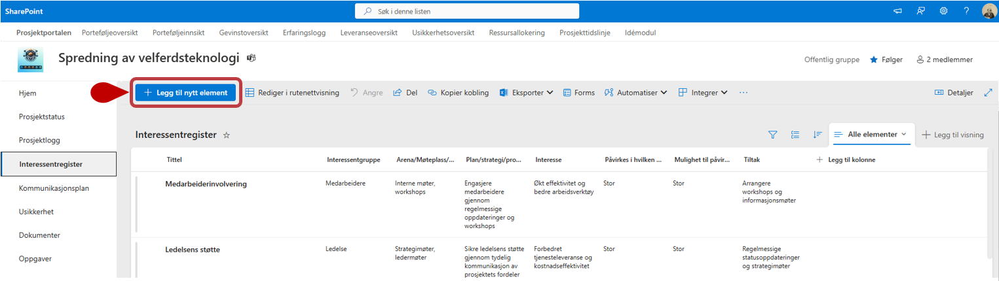
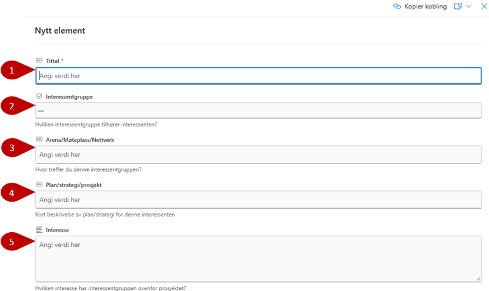
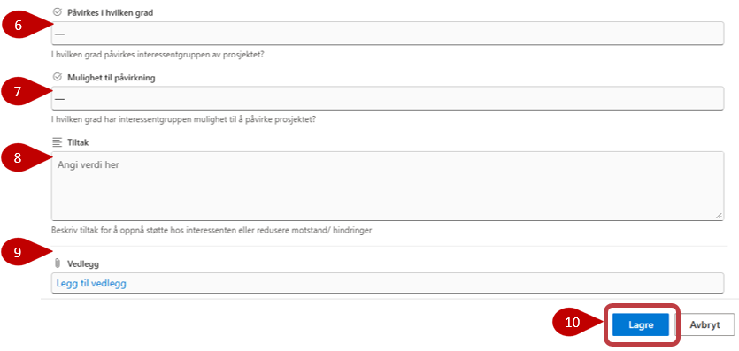

# Interessentregister

Interessentregisteret brukes til å organisere og dokumentere
interessenter som påvirkes av, eller som kan påvirke, prosjektet.

Trykk på **Legg til nytt element** for å opprette nytt interessentregister.

## Opprette nytt register

Fyll ut feltene med relevant informasjon. Les under bilde for beskrivelse av alle felt.

1. Feltet **Tittel** er markert med stjerne, disse er obligatoriske å fylle ut, og du får ikke lagret før det er gjort.
2. **Interessentgruppe** er et felt med følgende forhåndsdefinerte verdier:
    - Medarbeidere
    - Ledelse
    - Innbyggere
    - Næringsliv
    - Frivillighet/Organisasjon
    - Fagforening
    - Andre offentlige aktører
    - Akademia
    - Virkemiddelapparat
    - Brukere
3. **Arena/Møteplass/Nettverk** - Oppgi hvor og i hvilken arena denne gruppen treffes
4. **Plan/Strategi/Prosjekt** - Oppgi hva planen/strategien er for denne interessenten
5. **Interesse** -  Beskriv hvilken interesse interessentgruppen har overfor prosjektet
6. **Påvirkes i hvilken grad** - Denne felt har forhåndsdefinerte verdier og du kan velge i hvilken grad interessentgruppen påvirkes av prosjektet
7. **Mulighet til påvirkning** - Denne felt har forhåndsdefinerte verdier og du kan velge i hvilken grad interessentgruppen har mulighet til å påvirke prosjektet.
8. **Tiltak** - Her kan du beskrive hvilke tiltak som kan brukes for å kunne oppnå støtte og få med seg interessenten og redusere motstand og hindre
9. **Vedlegg** kan legges til på enkelte elementer. Merk at disse vedleggene bare vil bli lagret i denne listen, og blir ikke vist i dokumentbiblioteket.
10. Husk å **Lagre** når du er ferdig i bunn av listen.

I noen tilfeller vil det være en standardliste med interessenter som er relevante for de fleste prosjekter. Disse kan vedlikeholdes på porteføljenivå og genereres ved opprettelse i nye prosjekter.
