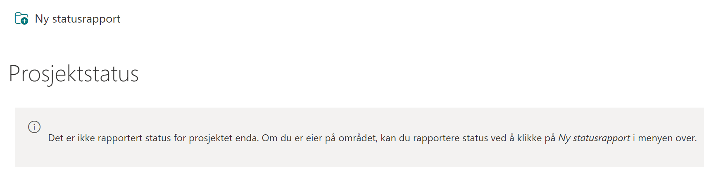
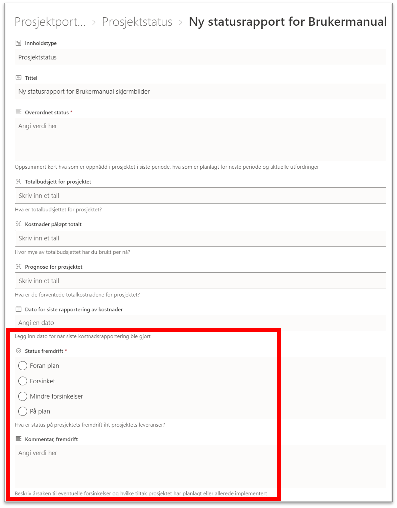
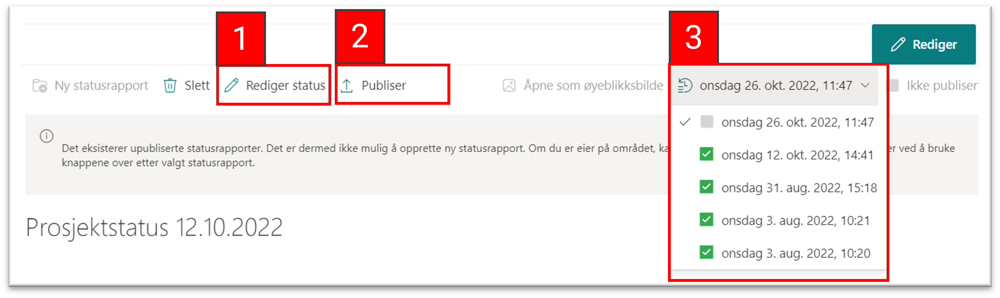
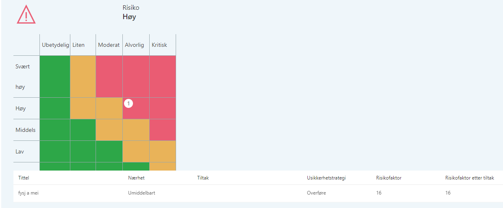

# Prosjektstatus
{: .no_toc}

## Innhold
{: .no_toc .text-delta }

1. TOC
{:toc}

Prosjektstatus er en sammenstilling av informasjon om prosjektet, hvor noe rapporteres inn gjennom statusrapportene direkte, mens annet hentes fra prosjektinformasjonen. Oversikten gir deg en visuell fremstilling på nåværende status og fremgang i prosjektet.

Før første statusrapport er opprettet vil vinduet se ut som bildet under.

## Opprette en statusrapport

Du oppretter statusrapporten ved å klikke på *Ny statusrapport*. Nå vil du bli presentert for alle de feltene som skal innrapporteres. Allefelter som er markert med en stjerne må være utfylt for at du skal få lagret rapporten.

Noen felt i rapporten er fritekst, eller tallverdier, og andre har forhåndsdefinerte verdier, som vist i bildet til høyre med *Status fremdrift* .

I tillegg til *Status fremdrift* har du seksjoner for:

  - Status økonomi
  - Status kvalitet
  - Status risiko [(mer informasjon om rapporten under Usikkerhet)](./4.4.5%20Usikkerhet.html)
  - Status gevinstoppnåelse

Det er også mulig å legge til egne kommentarer der det er behov for å utdype med mer detaljer. Dette gjør du i kommentarfeltet i bunnen av hver seksjon.

## Lagre, redigere og publisere en statusrapport

Når du har fylt i hele statusrapporten kan denne lagres. Rapporten vil da bli presentert grafisk på skjermen. Du kan nå se over rapporten og gjøre eventuelle endringer ved å trykke på *Rediger status* (1 i bildet under) dersom det er noe som skal endres på.

Når du er fornøyd med rapporten velger du *Publiser*, (2 i bildet under) og rapporten blir lagret og skrivebeskyttet. Data fra rapporten blir gjort tilgjengelig for Porteføljeområdet.

Det er bare data fra den siste *publiserte* rapporten som blir vist på Porteføljenivå.

Tidligere statusrapporter finner du igjen i nedtrekks-menyen på høyre side. (3 i bildet under)

 

## Statusrapporten i visningsmodus

Du finner statusrapporten i venstremenyen. Når du klikker deg inn vil du se rapporten i visningsmodus, og den ser slik ut:

## Prosjektdata og annet dynamisk innhold i statusrapporten

Informasjon om leveranser i prosjektet vil bli inkludert i
statusrapporten dersom slike finnes.

Risikoer vil også bli indikert i en risikomatrise dersom det er
registrert risikoer i prosjektet.

