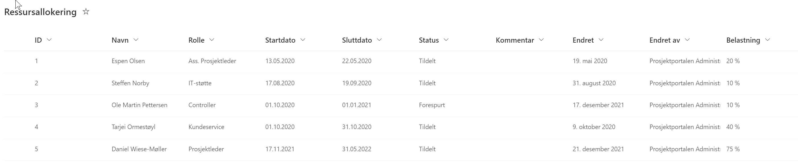
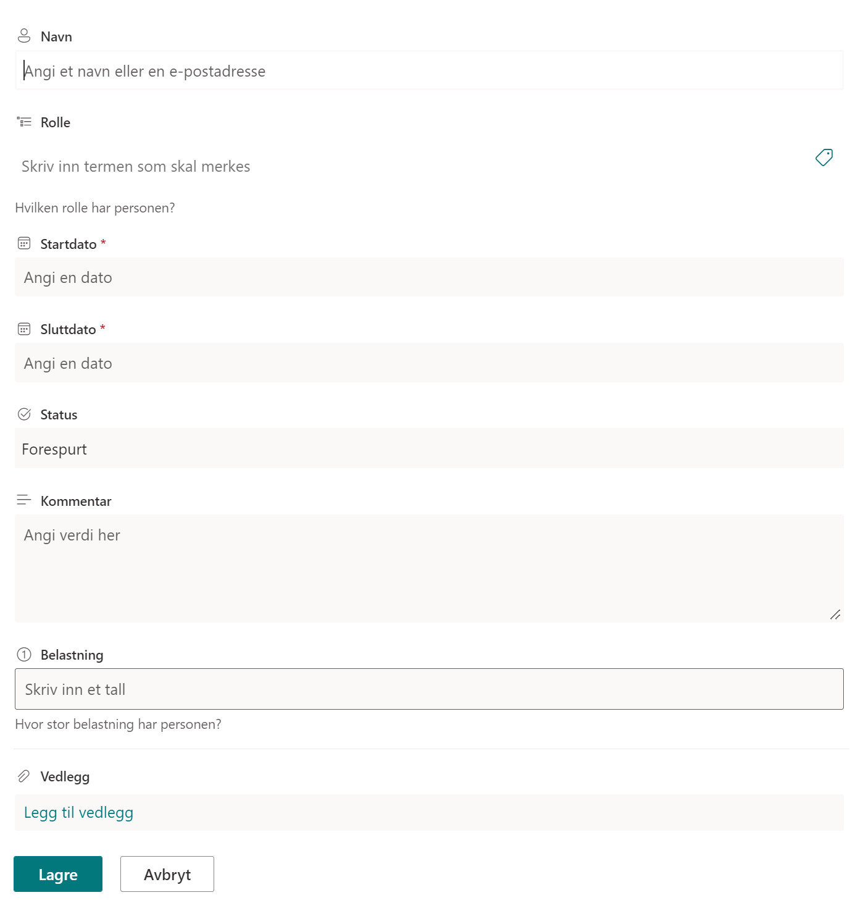

# Ressursallokering

Med *Ressursallokeringen* kan prosjektet sette opp de aktuelle
deltagerne i prosjektet.

Hver enkelt prosjektdeltager registreres med tiltenkt rolle, tidsperiode og belastning i denne perioden.

Rolle som kan velges er ut fra de forhåndsdefinerte verdiene:

  - Prosjekteier
  - Prosjektleder
  - Innleid prosjektleder
  - Ass. Prosjektleder
  - Controller
  - Kvalitetsleder
  - Brukerkoordinator
  - Prosjektmedlem
  - IT-støtte
  - Konsulent
  - Rådgiver
  - Kundeservice

Denne rollelisten er administrert som et forvaltet termsett, og vil være felles for alle prosjekter i en installasjon av Prosjektportalen.

Under ser du et eksempel liste med *Ressursallokering*
Å legge til ny ressurs trykk på *Ny* og legg til element (ser skjermbildet under)

***Eksempel Liste***

***Legg til Ny ressurs/Nytt element***

