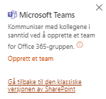
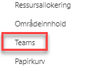

# Øvrige valg i menyen

|                           |                           |
|---------------------------|---------------------------|
|   |   |

## Områdeinnhold

Her finner du alle lister og bibliotek som er tilgjengelige i
prosjektet. 
    
##  Teams  

I alle nye prosjekter vil du se en Teams-kobling helt nederst i
venstre hjørne av menyen. Med denne koblingen kan du opprette et
team som vil være tilgjengelig i Microsoft Teams-appen.  
      
Etter at teamet er opprettet vil denne koblingen skjules og
erstattes med menyvalget *Teams*, som legger seg inn mellom
områdeinnhold og Papirkurv. Med dette menyvalget vil du kunne gå
rett over i Microsoft Teams hvor du kan fortsette å arbeide mot
prosjektet.

##  Papirkurv  
Her finner du alt du har slettet fra prosjektområdet, og kan
gjenopprette elementer om du har slettet noe ved uhell. Områdeeier kan se alt som er slettet, og kan gjenopprette uavhengig om det ble slettet av noen andre. Du kan lære mer om papirkurven i [Microsoft sine egne supportsider](https://support.office.com/nb-no/article/Behandle-papirkurven-for-et-SharePoint-omr%C3%A5de-8A6C2198-910E-42DC-9A9C-BC5BC4F327DA ).