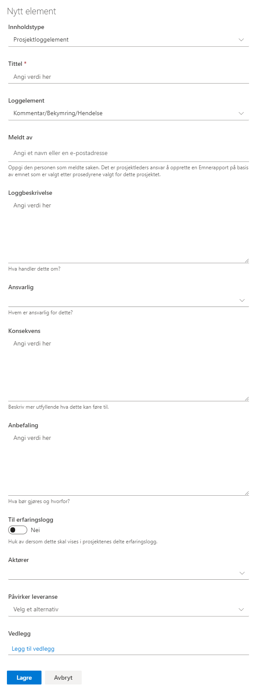

# Prosjektlogg

Prosjektloggen brukes som et verktøy for å registrere og samle
erfaringer i ett prosjekt. Lista kan knyttes opp mot prosjektleveranser, slik at man kan spore hvilke leveranser det er registrert erfaringer på.

Det er definert 4 ulike kategorier (kalt *Loggelement* i listen)*:*

  - Kommentar/Bekymring/Hendelse
  - Endringsforespørsel
  - Avvik fra spesifikasjon
  - Beslutning

Feltet *Meldt av* er et person-felt hvor du kan oppgi hvem som har meldt saken.

Feltet *Ansvarlig* er et felt med forhåndsdefinerte verdier og benyttes som et sorteringselement. De forhåndsdefinerte verdiene for dette feltet er Prosjekteier, Linjeorganisasjon, Prosjektleder, Prosjektgruppe, Leverandør, Referansegruppe og Andre.

De elementer som er av betydning for andre prosjekter, kan gjøres
tilgjengelig for Porteføljenivået ved å slå på bryteren *Til
erfaringsloggen = Ja.*

Feltet *Aktører* har forhåndsdefinerte verdier (Leverandører,
Prosjektstyre, Prosjektgruppe, Referansegruppe og Andre interessenter). Man kan velge en eller flere av disse.

Om ønskelig kan du koble elementet til en leveranse med feltet *Påvirker leveranse*. Det velges da fra listen *Prosjektleveranser*.

Vedlegg kan legges til på enkelt elementer. Merk at disse vedleggene vil bare bli lagret i denne listen, og blir ikke vist i dokumentbiblioteket.

