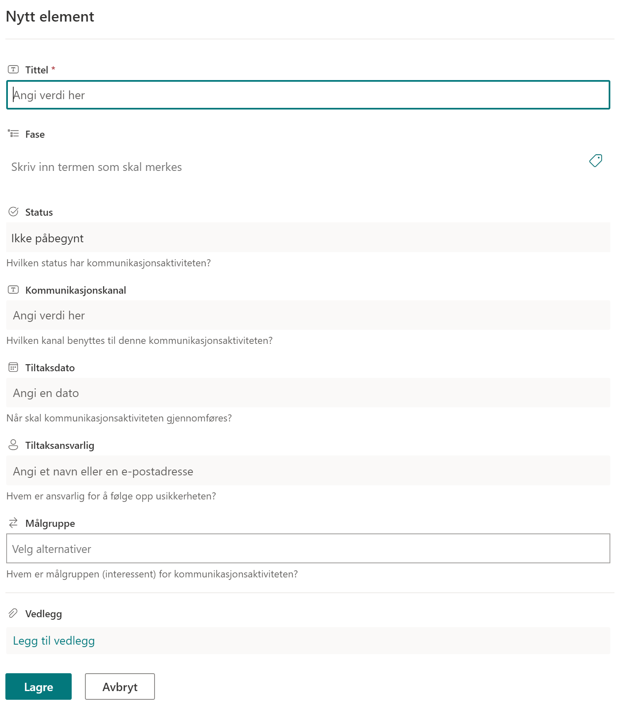

# Kommunikasjonsplan

Kommunikasjonsplanen brukes til å planlegge og utføre alt av
kommunikasjon i og rundt prosjektet.

Hvert enkelt kommunikasjonselement kan knyttes til en fase i prosjektet.

Status kan settes ut fra de forhåndsdefinerte verdiene:

  - Ikke påbegynt
  - Påbegynt
  - Fullført
  - Utsatt

Målgruppe kan hentes ut fra interessentregisteret, hvor det også ligger mer informasjon rundt interessenten. Det kan velges flere målgrupper for hvert enkelt kommunikasjonselement.

Vedlegg kan legges til på enkelt elementer. Merk at disse vedleggene bare lagres i denne listen, og blir ikke vist i dokumentbiblioteket.

