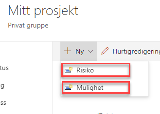

# Usikkerhet

Usikkerhetslista lar prosjektdeltagere loggføre alle
usikkerhetselementer som har oppstått, eller som har risiko for å
oppstå, i løpet av et prosjekt.

Usikkerheter kan registreres som ***Mulighet*** eller ***Risiko*** og knyttes til fase i prosjektet.

Ved å trykke på tittelen på lista eller *Usikkerhet* i venstremenyen ser du alle usikkerheter, uavhengig av fase.

Usikkerheter som er registrert og har status som ***Identifisert*** vil synliggjøres i Prosjektstatus under ***Risiko**.*

## Legge til ny usikkerhet

Når det legges inn en ny usikkerhet, er det en mengde data som legges inn på den aktuelle risiko eller mulighet. Det er de samme dataene som er aktuelle for både risiko og muligheter.

Usikkerheten kan knyttes opp mot en prosjektfase om ønskelig.

Dataverdien *Nærhet* har følgende forhåndsdefinerte verdier:

  - Umiddelbart
  - I denne fasen
  - Innenfor prosjektet
  - Utenfor prosjektet

*Usikkerhetsstrategi* har disse forhåndsdefinerte verdiene:

  - Redusere
  - Overvåke
  - Unngå
  - Overføre
  - Dale
  - Akseptere
  - Øke
  - Utnytte

Bryteren *Vis i portefølje* gjør det mulig å vise den aktuelle risikoen i Risikooversikten på Porteføljenivå.

Vedlegg kan legges til på enkelt elementer. Merk at disse vedleggene bare lagres i denne listen, og blir ikke vist i dokumentbiblioteket.

