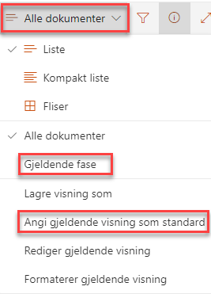
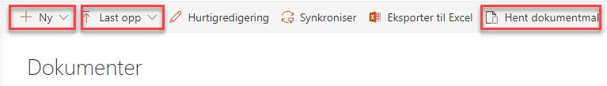
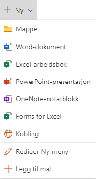
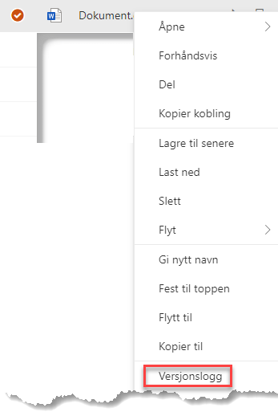
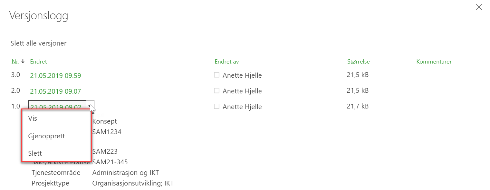

# Dokumenter
{: .no_toc}

## Innhold
{: .no_toc .text-delta }

1. TOC
{:toc}

SharePoint og Prosjektportalen har fantastiske verktøy for å dele,skrive sammen på og vedlikeholde prosjektdokumenter. Dette avsnittet tar for seg grunnleggende dokumenthåndtering. For mer informasjon om dokumenthåndtering gå til [Microsoft sine egne supportsider](https://support.office.com/nb-no/article/Hva-er-et-dokumentbibliotek-3b5976dd-65cf-4c9e-bf5a-713c10ca2872?ui=nb-NO&rs=nb-NO&ad=NO).

## Dokumentvisning på forsiden av prosjektområdet

På forsiden av prosjektområdet er det bygget inn en visning av prosjektdokumenter. Denne visningen fremstiller dokumentene basert på det som heter «standard visning». En god praksis
kan være å la visningen «Gjeldende fase» stå som «standard visning», på denne måten er det dokumenter tilknyttet den fasen prosjektet er i som vises på prosjektets hjemmeside.

Hva som skal være standardvisning kan defineres i dokumentbiblioteket ved å bruke visningsmenyen på høyre side.

Alle dokumentene i prosjektet ligger i dokumentbiblioteket, som er tilgjengelig i venstremenyen med tittelen "Dokumenter".

Når prosjektet ble opprettet var det et valg for å legge et sett med standarddokumenter fra Porteføljeområdet inn i prosjektet. Disse er som regel allerede knyttet opp mot ulike faser i prosjektet. I tillegg kan deltakerne selv legge til, fjerne og redigere dokumenter i prosjektområdet.

## Laste opp dokument(er) i prosjektområdet

I tillegg til å legge inn standarddokumenter ved opprettelse av
prosjektet, er det flere metoder som kan benyttes for å få dokumenter inn i et prosjekt på:

1.  Hent dokumentmal
2.  Ny knappen
3.  Dra-og-slipp-metoden
4.  Last opp-knappen

Vi beskriver disse kort i denne manualen, med fokus på *Hent
dokumentmal* som er en spesialtilpasset metoden for Prosjektportalen.

Det kan være begrensninger på enkelte av funksjonene. Dette gjelder forhold som styres fra sentralt hold og som Prosjektportalen dermed ikke kan overstyre. I tillegg kan du oppleve at nettlesere oppfører seg noe ulikt.

### Hent dokumentmal

Med denne funksjonen er det dokumentene som ligger i *Malbiblioteket* på Porteføljenivå som benyttes som kilde. Ved å trykke på *Hent dokumentmal* får du en oversikt over dokumentmalene som ligger der.

Her vil det alltid være siste utgave av malen som blir tatt med over til prosjektet. Dette er med på å styrke samhandlingen rundt bruk av maler, og sikre at man til enhver tid arbeider med siste mal.

Disse malene vil også allerede kunne være merket med relevant
prosjektfase.

### Ny-knappen

Med "Ny"-knappen kan du opprette et nytt dokument i dokumentbiblioteket.
Hva slags dokumenter du kan opprette er styrt av prosjektområdets
innholdstyper.

### Dra-og-slipp-metoden

Har du dokumenter liggende på en filkatalog eller som vedlegg i en epost er det lett å kopiere disse rett inn i dokumentbiblioteket ved å markere de i systemet de ligger, og kort og greit dra-og-slippe dem inn i dokumentbiblioteket. 

### Last opp-knappen

Du kan også benytte deg av "Last opp"-knappen som ligger i toppmenyen i dokumentbiblioteket. Her blar du deg frem til de aktuelle dokumentene på din egen PC, og velger disse for opplasting.

Dokumentene du laster opp blir ikke flyttet, men kopiert inn i
biblioteket.

## Redigere egenskapene til et dokument

Du kan redigere egenskapene til et dokument. Om du ønsker å (for
eksempel) endre fase på et dokument kan du gjøre dette på flere måter direkte i biblioteket:

| Funksjon         | Beskrivelse                                                                                                                        |
| ---------------- | ---------------------------------------------------------------------------------------------------------------------------------- |
| Hurtigredigering | Bruk dette valget for å gjøre endringer direkte i dokumentlisten. Husk å avslutte hurtigredigering etterpå for å lagre endringene. |
| Ellipsemenyen    | Velg *Mer* og så *Egenskaper* for å åpne egenskapsvinduet, og rediger etter behov.                                                 |
| Detaljruten      | Marker et dokument i listen. Dette åpner detaljruten på høyre side . Her kan du velge *Rediger alle.*      |

## Versjonslogg

Versjonsloggen er et fantastisk verktøy som gir deg kontroll over ulike versjoner av et dokument uten at det tar opp ekstra plass, og uten behov for å kalle dokumentet "versjon 1.0, 2.0,
3.0" osv.

For hver lagring som blir gjort, blir en ny versjon av dokumentet
opprettet automatisk. Ved samskriving skjer dette omtrent hvert minutt.

Du finner versjonsloggen i ellipsemenyen til dokumentet. Menyen er tilgjengelig to steder når du har markert et dokument. Du kan også høyreklikke over dokumentet.

I versjonsloggen kan du se på tidligere versjoner ved å trykke på dato og tidspunkt i "Endret"-kolonnen, eller gjenopprette tidligere versjoner ved å trykke på nedtrekkspilen som du ser hvis du drar musepekeren over en versjon (markert med rød boks).

Når du gjenoppretter en tidligere versjon, blir den nåværende versjonen lagret i versjonsloggen.

## Slettede filer 

Dokumenter som slettes, havner i papirkurven. Dokumenter som ligger i papirkurven kan gjenopprettes av den som slettet, eller eier av område i løpet av 60-90 dager. Du kan lese mer om papirkurven i [Microsoft sine egne supportsider](https://support.office.com/nb-no/article/Gjenopprette-elementer-i-papirkurven-p%C3%A5-et-SharePoint-omr%C3%A5de-6df466b6-55f2-4898-8d6e-c0dff851a0be?omkt=nb-NO&ui=nb-NO&rs=nb-NO&ad=NO).