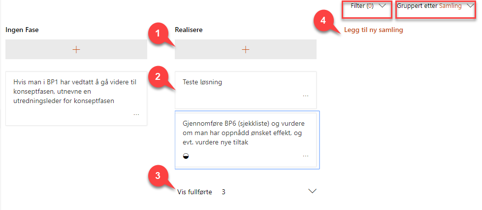

# Oppgaver
{: .no_toc}

## Innhold
{: .no_toc .text-delta }

1. TOC
{:toc}

Prosjektportalen 365 benytter Microsoft Planner til oppgavestyring.

Oppgavelisten brukes til å lage, planlegge og delegere oppgaver i
prosjektet. Når du oppretter et nytt prosjektrom kan du velge å ta med et sett med standardoppgaver inn til prosjektet. Prosjektportalen kommer med samme oppgaveliste som Difis Prosjektveiviser. Dette kan tilpasses i hver installasjon.  

## Oppgaver på prosjektets hjemmeside

På prosjektets hjemme side er det lagt inn en komponent som viser status på oppgavene i prosjektet. Denne komponenten kan stilles inn til ulike visninger, for å tilfredsstille behov i hvert enkelt prosjekt.

For å stille om til en annen visning:

  - Velg Rediger på prosjektets startside
  - Marker komponenten
  - Velg «Rediger nettdel» (blyantsymbolet)
  - Velg ønsket visning
  - Avslutt med «Publiser på nytt» på siden

Alle oppgavene og detaljer rundt disse finner du på prosjektets oppgave side i venstremenyen. I Prosjektportalen 365 kan oppgaver også håndteres i Microsoft Planner.

## Oppgavesiden i prosjektet

På prosjektets oppgaveside vil du kunne bearbeide alle oppgaver i
prosjektet.

Typiske aktiviteter når du arbeider med oppgaver er

1.  Opprette ny oppgave i en samling
2.  Velg en oppgave for å komme inn på oppgavens detaljside (se neste kapittel)
3.  Vise/skjule fullførte oppgaver
4.  Opprette en ny samling

Du kan også betjene visningsområdet på siden med funksjonene:

  - Filter – Velg et filter du ønsker å benytte deg av. Her kan du velge blant fritekst, forfaller, etikett, samling eller
    tildelt.
  - Gruppert etter – Her kan du velge hvilken gruppering du ønsker

## Oppbygning av oppgaver i Microsoft Planner

1)  **Tilordne** – Her legger du inn navnet på den eller de som er ansvarlig for oppgaven (kan være flere personer om ønskelig)
2)  **Samling** – Med dette feltet kan du kategorisere oppgaver, for eksempel etter fase.
3)  **Fremdrift** – Angivelse av fremdriftsstatus på oppgaven
4)  **Sjekkliste** – Kan benyttes til deloppgaver
5)  **Etiketter** – Etiketter kan benyttes til å markere enkeltoppgaver med farge/kode (kan benyttes til gruppering)
6)  **Kommentar** – Dette er en logg for den enkelte saken, hvor de som har saken tilordnet seg vil bli varslet pr epost når du trykker *Send* 
7)  **Startdato** – Planlagt tidspunkt for oppstart 
8) **Forfallsdato** – Dato når oppgaven skal være løst