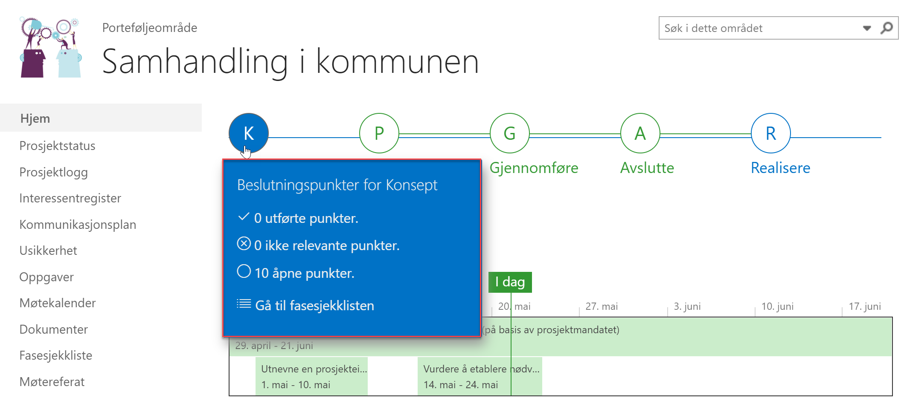
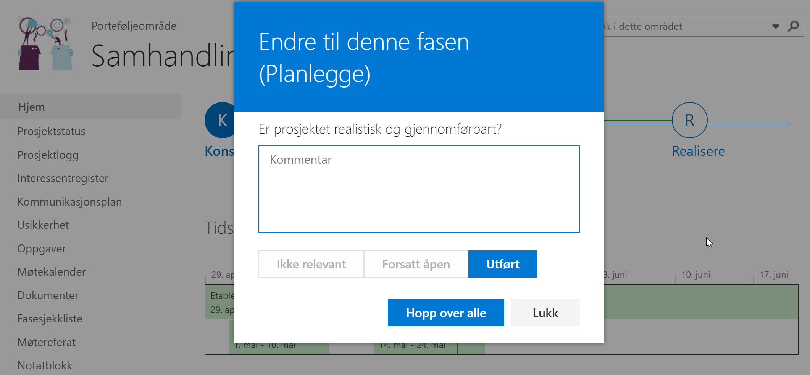
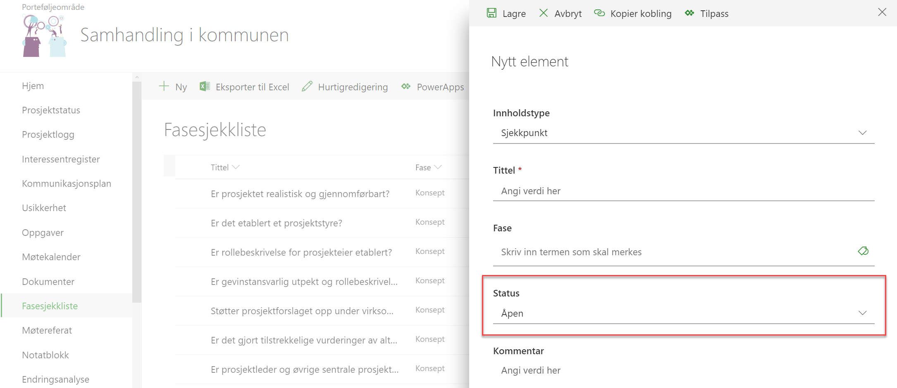

# Fasesjekkliste
{: .no_toc}

## Innhold
{: .no_toc .text-delta }

1. TOC
{:toc}

Fasesjekklisten er et verktøy som lar prosjektdeltagere og prosjektleder eller prosjekteier gå gjennom en forhåndsdefinert sjekkliste underveis i eller ved endring av en fase i prosjektet. I noen prosjekter er ikke alle sjekkpunkter like relevante. Dette avsnittet viser hvordan sjekklisten fungerer, og hvordan du kan legge til, endre eller slette sjekkpunkter i listen.

## Gjennomgang av sjekkpunkter ved endring av fase

I faseviseren på forsiden av prosjektet får du en indikasjon på hvor mange sjekkpunkter som er utført ila hver fase ved å holde musepekeren over en fase.

Når du har kommet til faseendring i prosjektet, trykker du på *Endre til denne fasen* under den nye fasen (i bildet under vil vi endre fra Konsept-fasen til Planlegge-fasen).

Nå vil Prosjektportalen kontrollere om fasesjekkpunktene i den fasen du går fra er utført. Dersom alt er utført, vil du bli bedt om å bekrefte at du vil bytte fase.

Dersom noen av fasesjekkpunktene ikke er utført, vil en dialogboks åpne seg og du blir bedt om å besvare de gjenstående
fasesjekkpunktene.

Her er valgene *Utført*, *Ikke relevant*, *Hopp over alle* eller *Lukk* (som lukker dialogboksen). For å kunne gå videre må du skrive en kommentar hvis du velger noe annet enn *Ikke relevant*.

## Redigere prosjektets fasesjekkpunkter

Trykk på Fasesjekkliste i venstremenyen for å åpne den.

Trykk deretter på *Ny for å opprette et nytt fasesjekkpunkt*.

Fyll inn relevant innhold, inkludert *fasen* sjekkpunktet tilhører. Husk å la status stå som *Åpen* hvis det er noe
som skal gjennomgås senere.

Eksisterende fasesjekkpunkter kan redigeres ved å markere et enkelte element, og velge *Rediger.* Igjen, husk å la et fasesjekkpunkt stå som *Åpen* dersom det er et punkt som skal bli tatt stilling til på et senere tidspunkt