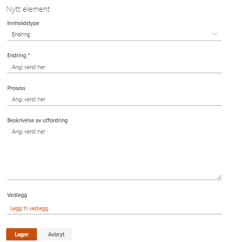
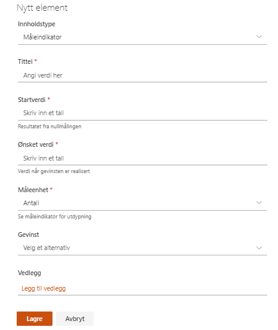
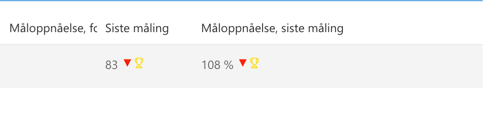

# Gevinstarbeid i prosjekter
{: .no_toc}

## Innhold
{: .no_toc .text-delta }

1. TOC
{:toc}

Gevinstarbeid i Prosjektportalen er basert på prinsippene til Kommunenes Sentralforbund (KS) sin «Gevinstkokebok for IKT-prosjekter i norske kommuner».

> Du kan laste ned Gevinstkokeboka på KS sine hjemmesider.

## Endringsanalyse

Endringsanalyse er et verktøy for å analysere endringer i prosesser. Dette brukes til å identifisere og kartlegge gevinster i gevinstanalyse og gevinstrealiseringsplan.

## Gevinstanalyse og gevinstrealiseringsplan

I gevinstanalyse og gevinstrealiseringsplanen føres en analyse på alle beregnede og identifiserte gevinster prosjektet skal resultere i. Disse kan knyttes til endringer som er oppført i endringsanalysen.

I likhet med endringsanalysen, er gevinstanalyse og
gevinstrealiseringsplanen laget etter prinsipper fra gevinstkokeboka.

Informasjonen som legges i denne lista, eller i gevinstoppfølging, blir synlige i gevinstoversikten på porteføljenivå. Der er de tilgjengelig for alle som har tilgang til prosjektområdet.

## Måleindikatorer

Med måleindikatorer setter du opp hvilke konkrete måleparameter du ønsker å måle i prosjektet.

Hver enkelt måleindikator settes opp med startverdi og ønsket verdi, samt at den knyttes til den gevinsten den har påvirkning mot.

## Gevinstoppfølging

Dette er et verktøy for å utføre målinger på gevinster, sånn at du kan følge med på utviklingen i henhold til målet som er satt.

Ved registrering av en måling velger du hvilken måleindikator den
aktuelle målingen gjelder for.

I listen vil da alle målinger bli gruppert inn under sin tilhørende måleindikator.

Resultater fra gevinstoppfølgingen blir automatisk oppdatert i
gevinstoversikten på porteføljenivå.

## Gevinstoversikt

Gevinstoversikten blir automatisk generert når det er registrert
gevinster, og målinger av gevinster, i prosjektet. Her får deltagere et oversiktsbilde over gevinster, samt status på disse indikert med tall og piler.

Ved å klikke på *Vis alle målinger* til høyre på en av linjene, vil du kunne se alle målinger utført for denne gevinsten.

Hvis måloppnåelsen er større enn 100% vil en liten pokal dukke opp ved siden av resultatet som vist under:

All tilgjengelig informasjon i gevinstoversikten vises også på
porteføljenivå for de som har tilgang til prosjektet.