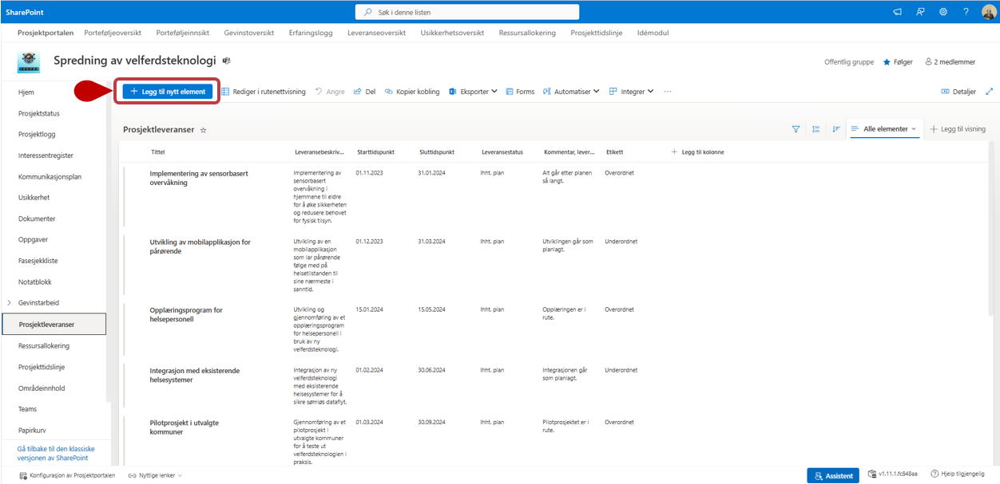
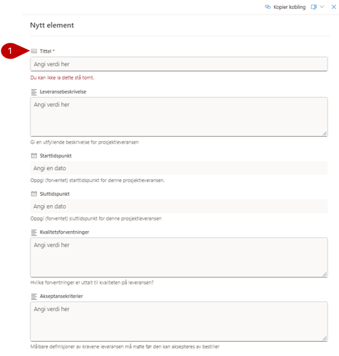
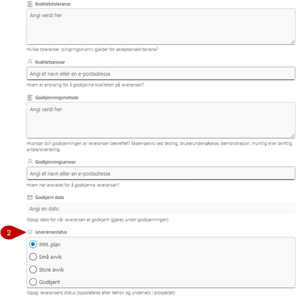
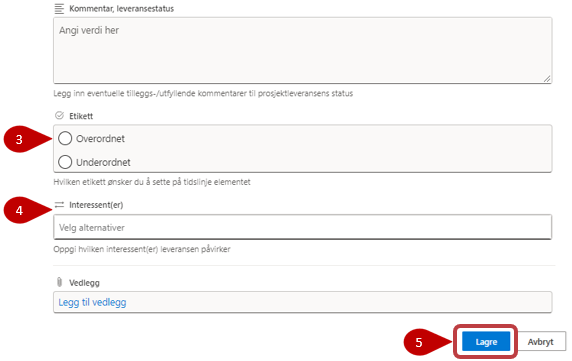

# Prosjektleveranser

I dette verktøyet registreres og vedlikeholdes alle leveranser for prosjektet. Alle leveranser kan knyttes opp mot målgrupper fra interessentlisten.

Trykk på **Legg til nytt element** for å opprette Nye elementer/erfaringer.

## Legge til ny leveranse/element

Fyll inn skjemaet i henhold til leveransen og med relevant informasjon. Les under her for beskrivelse av alle felt.

1. Feltet Tittel er markert med stjerne, disse er obligatoriske å fylle ut, og du får ikke lagret før det er gjort.
2. Sett en leveransestatus for å enkelt kunne følge opp leveransen
3. **Etikett** - Velg en etikett for å enklere kunne filtrere på leveransene. Du kan sette opp forhåndsdefinerte valg og disse valgene kan tilpasses til dine behov. De forhåndsdefinerte valgene her er:
    - Overordnet
    - Underordnet
4. Du kan velge interessentgruppe fra **Interessent(er)**-feltet hvis leveransen er relevant for en konkret interessent.
5. Husk å **Lagre** når du er ferdig i bunn av listen.

