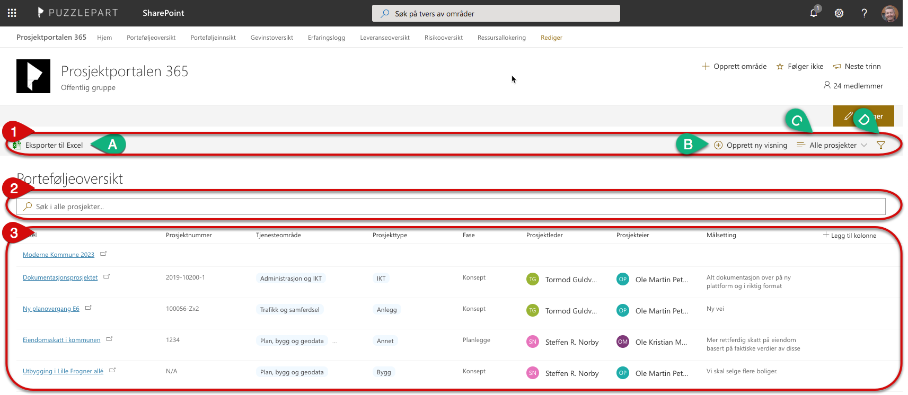
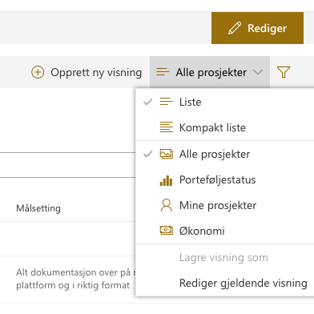
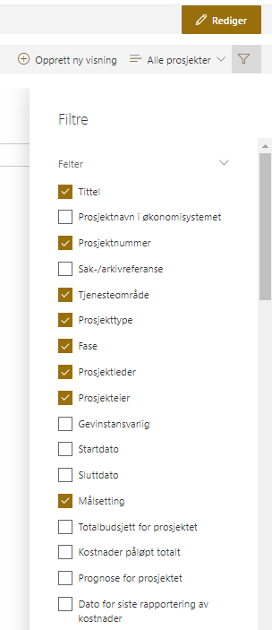

# Porteføljeoversikt

Porteføljeoversikten gir et øyeblikksbilde over alle prosjektene i
porteføljen. Denne oversikten kan enkelt endres slik at du ser den
informasjonen du trenger.

1. I den øverste linjen finner du gruppering-, eksportering-, visning-, og filtermuligheter.

    - A) Trykk på *Eksporter til Excel* for å eksportere den visningen du
   har valgt til et Excel-ark som automatisk lastes ned til
   datamaskinen din.
    - B) Trykk på  for å opprette ny visning.

    - C) Trykk på  **Alle prosjekter** for å velge andre visninger som Porteføljestatus, Mine prosjekter og Økonomi. Her vises også eventuelle tilpassede visninger som er opprettet for denne porteføljen.
    
    

    - D) Trykk på  for å velge flere felter å vise. Her kan du også angi et eller flere felter som du ønsker å filtrere på.

    

2. Bruk søkefeltet for å filtrere listen på ønskede nøkkelord.

3. Her vises informasjon om prosjektene på bakgrunn av visningen du har valgt. Trykk på tittelen til et prosjekt for å gå til prosjektrommet.