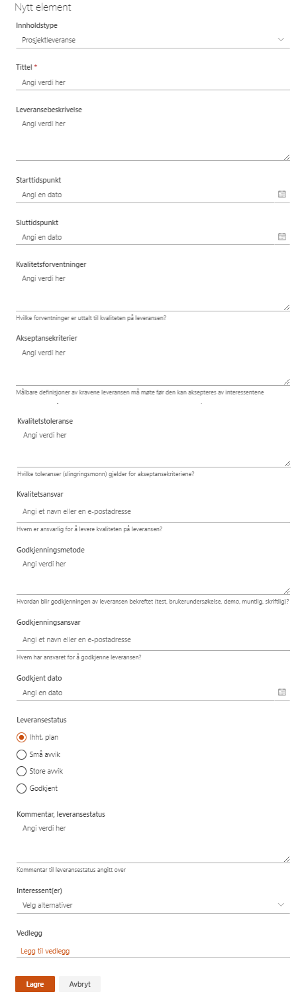

# Prosjektleveranser

I dette verktøyet registreres og vedlikeholdes alle leveranser for prosjektet. Alle leveranser kan knyttes opp mot målgrupper fra interessentlisten.

## Legge til ny leveranse

> Klikk på *Ny* i menyen.

Fyll inn skjemaet i henhold til leveransen og velg interessentgruppe fra Interessent(er)-feltet hvis dette er relevant for en konkret målgruppe.

